```python
import torch
```

# Нейронная сеть на Pytorch

## Введение

Базовой единицей фреймворка является структура, которая называется torch.Tensor. Tensor - это аналог numpy.array, многие методы работы с torch.Tensor в точности повторяют методы numpy array.

Тензор — это тот тип данных, с которыми работают все нейросети в PyTorch. Матрицы весов слоев сети — это тензоры. Данные, которые мы подаем на вход сети тоже обязательно должны быть приведены к типу torch.Tensor. Ну и выход сети, разумеется, тоже будет иметь тип torch.Tensor.


```python
# модуль, в котором определены все классы слоев сетей и функций активации
import torch.nn as nn

n = 5
m = 3
# аргумент bias принимает значения True и False и определяет, будет ли в слое
# применяться bias. Если bias=False, вектор байеса равен нулю. True - default
# тут сразу же инициализируются веса 
linear_layer = nn.Linear(n, m, bias=True)
```


```python
linear_layer
```


    Linear(in_features=5, out_features=3, bias=True)


```python
linear_layer.weight
```


    Parameter containing:
    tensor([[ 0.2882,  0.1029,  0.1476,  0.1998, -0.3552],
            [ 0.0597,  0.2789,  0.2204,  0.2829, -0.3960],
            [-0.0583,  0.2286,  0.3763, -0.1856,  0.0006]], requires_grad=True)


Далее — функция активации. Многие известные функции активации реализованы в модуле nn и продублированы в модуле nn.functional. Выберем какую-нибудь из них, например, гиперболический тангенс (tanh).


```python
# Можно использовать такой вариант:

# import torch.nn.functional as F
# activation = F.tanh

# или такой вариант:
activation = nn.Tanh()
```


```python
x_tensor = torch.tensor([
    [1, 2],
    [3, 4]
])
activation(x_tensor)
```


    tensor([[0.7616, 0.9640],
            [0.9951, 0.9993]])


Теперь проход некоторого тензора с данными через такой полносвязный слой будет задан при помощи последовательности команд:


```python
random_input = torch.rand(5)

x = linear_layer(random_input)
output = activation(x)
output
```


    tensor([ 0.1133,  0.4980, -0.0533], grad_fn=<TanhBackward0>)


Обратим внимание на `grad_fn=<TanhBackward0>`. Такая приписка будет появляться на всех тензорах, которые являются обучающими параметрами в нейросети. Это значит, что для данного тензора в процессе обучения сети будет вычисляться градиент, с помощью которого значения тензора будут обновляться.

## Полносвязная нейросеть для бинарной классификации


Зададим датасет для бинарной классификации точек на плоскости:


```python
import numpy as np
from sklearn.datasets import make_blobs
import matplotlib.pyplot as plt

# генерируем 1200 точек, распределенных вокруг двух центров: (-2,0.5) и (3,-0.5)
X, y = make_blobs(n_samples=1200, centers=[[-2,0.5],[3,-0.5]], cluster_std=1, random_state=42)

# отрисовываем точки на плоскости, покрасив их в два цвета в зависимости от класса
colors = ("red", "green")
colored_y = np.zeros(y.size, dtype=str)

for i, cl in enumerate([0,1]):
    colored_y[y.ravel() == cl] = str(colors[i])

plt.figure(figsize=(10,7))
plt.scatter(X[:, 0], X[:, 1], c=colored_y)
plt.show()
```


    

    


```python
from sklearn.model_selection import train_test_split

X_train, X_test, y_train, y_test = train_test_split(X, y, test_size=200)
```


```python
X_train
```


    array([[ 4.39020755,  0.05781031],
           [ 2.97248509,  1.2722516 ],
           [ 2.17240978, -0.41385612],
           ...,
           [ 1.39244014, -1.26272478],
           [ 2.32429192, -0.46584758],
           [-0.52210596, -0.01827022]])


```python
y_train
```


    array([1, 1, 1, 0, 0, 1, 0, 0, 1, 0, 0, 0, 1, 0, 1, 1, 0, 0, 1, 0, 0, 0,
           1, 0, 1, 1, 1, 1, 1, 0, 0, 0, 0, 1, 1, 0, 1, 0, 1, 1, 1, 1, 1, 0,
           1, 0, 1, 0, 0, 1, 0, 1, 1, 1, 1, 1, 1, 1, 1, 0, 0, 1, 0, 0, 0, 1,
           1, 1, 1, 0, 1, 1, 0, 1, 0, 1, 1, 0, 1, 1, 0, 0, 1, 1, 0, 0, 1, 1,
           0, 0, 1, 0, 1, 0, 1, 0, 1, 0, 1, 0, 0, 0, 0, 0, 1, 1, 1, 0, 1, 1,
           0, 0, 1, 1, 1, 0, 0, 0, 1, 1, 0, 1, 0, 1, 1, 1, 0, 0, 1, 1, 0, 1,
           1, 1, 1, 0, 1, 0, 0, 1, 0, 1, 0, 0, 1, 0, 0, 0, 0, 1, 1, 1, 1, 0,
           1, 1, 1, 1, 1, 0, 1, 0, 0, 0, 0, 0, 1, 0, 1, 1, 1, 1, 1, 0, 1, 1,
           1, 1, 0, 1, 1, 0, 0, 0, 1, 0, 0, 0, 0, 0, 0, 1, 0, 1, 1, 0, 1, 0,
           1, 0, 1, 1, 1, 0, 1, 0, 1, 0, 0, 1, 1, 0, 1, 1, 0, 1, 1, 0, 0, 1,
           1, 1, 0, 0, 0, 0, 0, 0, 0, 0, 0, 0, 0, 0, 0, 1, 0, 0, 0, 1, 1, 1,
           1, 0, 0, 0, 0, 1, 1, 0, 0, 1, 0, 0, 1, 0, 0, 0, 1, 1, 1, 0, 1, 0,
           0, 0, 0, 0, 1, 1, 1, 0, 0, 0, 1, 0, 1, 1, 0, 0, 0, 1, 1, 1, 0, 0,
           0, 1, 0, 1, 1, 0, 0, 1, 0, 1, 0, 1, 0, 0, 0, 0, 1, 1, 0, 0, 0, 0,
           1, 0, 1, 0, 1, 0, 1, 0, 0, 0, 1, 0, 1, 0, 0, 1, 0, 1, 1, 1, 1, 1,
           0, 0, 1, 0, 1, 1, 1, 0, 1, 0, 1, 1, 0, 1, 1, 0, 1, 1, 0, 1, 0, 0,
           0, 0, 0, 0, 0, 0, 1, 0, 1, 0, 1, 1, 1, 1, 1, 0, 1, 0, 0, 1, 0, 1,
           0, 1, 0, 0, 1, 1, 0, 1, 0, 1, 0, 0, 1, 1, 0, 0, 1, 0, 1, 0, 1, 0,
           1, 1, 0, 1, 0, 0, 0, 1, 0, 1, 0, 0, 0, 0, 0, 0, 1, 1, 1, 0, 1, 1,
           1, 1, 0, 1, 0, 0, 0, 0, 0, 0, 1, 0, 1, 0, 0, 0, 1, 0, 1, 1, 0, 1,
           0, 1, 1, 0, 1, 1, 1, 0, 1, 1, 0, 1, 0, 0, 1, 0, 1, 0, 0, 0, 0, 0,
           1, 1, 1, 1, 1, 0, 0, 1, 1, 1, 1, 1, 1, 0, 0, 0, 1, 1, 1, 1, 1, 0,
           1, 1, 0, 1, 1, 1, 0, 1, 1, 0, 1, 1, 0, 1, 1, 1, 1, 0, 0, 1, 0, 1,
           1, 1, 1, 0, 0, 0, 0, 0, 1, 0, 0, 0, 1, 0, 0, 0, 0, 0, 1, 0, 0, 0,
           0, 0, 0, 1, 1, 1, 0, 0, 1, 0, 0, 0, 0, 0, 1, 1, 0, 0, 0, 1, 1, 0,
           1, 1, 1, 0, 1, 0, 1, 1, 1, 1, 0, 0, 1, 1, 0, 1, 1, 1, 1, 0, 1, 1,
           0, 1, 1, 0, 1, 1, 0, 1, 0, 0, 1, 1, 0, 0, 0, 1, 0, 0, 1, 0, 0, 0,
           0, 1, 1, 0, 1, 0, 0, 0, 0, 1, 0, 1, 1, 0, 0, 0, 0, 1, 0, 1, 1, 0,
           1, 1, 1, 1, 1, 1, 0, 0, 0, 1, 0, 0, 0, 1, 0, 1, 1, 0, 0, 1, 1, 0,
           0, 0, 0, 0, 0, 1, 1, 0, 1, 0, 0, 0, 0, 1, 1, 0, 1, 0, 0, 0, 1, 0,
           1, 1, 1, 1, 1, 1, 0, 1, 0, 1, 0, 1, 1, 0, 1, 1, 0, 1, 0, 0, 1, 0,
           0, 1, 0, 0, 1, 0, 1, 0, 1, 0, 1, 0, 0, 1, 1, 0, 1, 0, 0, 1, 0, 0,
           1, 0, 1, 0, 1, 1, 0, 1, 1, 1, 1, 1, 1, 1, 1, 0, 1, 1, 0, 1, 0, 1,
           0, 1, 1, 0, 1, 1, 0, 0, 0, 0, 1, 1, 1, 1, 0, 1, 0, 1, 0, 0, 0, 0,
           0, 0, 0, 0, 1, 1, 1, 0, 0, 0, 1, 1, 1, 1, 0, 1, 0, 1, 0, 1, 1, 1,
           0, 1, 1, 0, 0, 0, 0, 0, 0, 0, 0, 1, 0, 1, 0, 0, 1, 0, 1, 1, 0, 1,
           0, 0, 0, 0, 0, 1, 0, 1, 1, 1, 1, 0, 1, 1, 0, 1, 0, 0, 0, 1, 0, 0,
           0, 1, 1, 1, 1, 1, 1, 1, 0, 1, 0, 1, 0, 1, 1, 1, 1, 0, 1, 0, 0, 0,
           1, 1, 1, 0, 0, 1, 1, 0, 0, 0, 1, 1, 1, 1, 0, 1, 0, 1, 0, 1, 1, 1,
           1, 1, 1, 0, 0, 0, 1, 1, 0, 1, 0, 1, 1, 0, 0, 0, 1, 0, 1, 1, 0, 1,
           1, 1, 1, 0, 1, 0, 0, 1, 1, 1, 1, 0, 0, 1, 1, 0, 0, 0, 1, 1, 1, 1,
           0, 0, 1, 0, 0, 0, 1, 0, 1, 0, 1, 0, 1, 1, 1, 0, 1, 0, 1, 1, 1, 1,
           0, 0, 0, 1, 1, 1, 0, 1, 1, 0, 1, 1, 1, 1, 1, 1, 0, 0, 1, 0, 0, 0,
           0, 1, 0, 0, 1, 1, 0, 0, 0, 1, 0, 0, 1, 1, 0, 0, 1, 0, 1, 0, 0, 1,
           0, 0, 1, 0, 0, 0, 0, 1, 0, 0, 0, 1, 1, 1, 1, 0, 0, 0, 0, 0, 1, 1,
           0, 0, 1, 0, 0, 1, 0, 1, 1, 0])


Давайте зададим нейронную сеть с двумя слоями. Пусть в скрытых слоях будет пять нейронов. В качестве функции активации выберем сигмоиду.
Нейросеть задается в виде класса, который наследуется от абстрактного класса Module. Для задания нейросети достаточно определить у класса методы __init__ и __forward__. В методе __init__ обычно прописываются слои и артибуты сети, а в __forward__ — то, как нейросеть будет обрабатывать данные, поданные ей на вход.


```python
import torch.nn as nn

class Net(nn.Module):
    def __init__(self):
        super(Net, self).__init__()

        self.fc1 = nn.Linear(2, 2)
        self.act1 = nn.Sigmoid() # можно заменить на nn.Tanh / nn.ReLU / ...

        self.fc2 = nn.Linear(2, 1)
        self.act2 = nn.Sigmoid()


    def forward(self, x):
        """
        params:
            x (torch.Tensor): данные, поданные на вход сети
        """

        x = self.fc1(x)
        x = self.act1(x)

        x = self.fc2(x)
        x = self.act2(x)
        return x
```


```python
model = Net()
nn_prediction = model(torch.FloatTensor(X_test))
nn_prediction = nn_prediction.tolist()
nn_prediction = np.array([int(x[0] > 0.5) for x in nn_prediction])
```


```python
nn_prediction
```


    array([1, 1, 1, 1, 1, 1, 1, 1, 1, 1, 1, 1, 1, 1, 1, 1, 1, 1, 1, 1, 1, 1,
           1, 1, 1, 1, 1, 1, 1, 1, 1, 1, 1, 1, 1, 1, 1, 1, 1, 1, 1, 1, 1, 1,
           1, 1, 1, 1, 1, 1, 1, 1, 1, 1, 1, 1, 1, 1, 1, 1, 1, 1, 1, 1, 1, 1,
           1, 1, 1, 1, 1, 1, 1, 1, 1, 1, 1, 1, 1, 1, 1, 1, 1, 1, 1, 1, 1, 1,
           1, 1, 1, 1, 1, 1, 1, 1, 1, 1, 1, 1, 1, 1, 1, 1, 1, 1, 1, 1, 1, 1,
           1, 1, 1, 1, 1, 1, 1, 1, 1, 1, 1, 1, 1, 1, 1, 1, 1, 1, 1, 1, 1, 1,
           1, 1, 1, 1, 1, 1, 1, 1, 1, 1, 1, 1, 1, 1, 1, 1, 1, 1, 1, 1, 1, 1,
           1, 1, 1, 1, 1, 1, 1, 1, 1, 1, 1, 1, 1, 1, 1, 1, 1, 1, 1, 1, 1, 1,
           1, 1, 1, 1, 1, 1, 1, 1, 1, 1, 1, 1, 1, 1, 1, 1, 1, 1, 1, 1, 1, 1,
           1, 1])


Визуализируем точки тестовой выборки и покрасим их в цвета в зависимости от того, к какому классу сеть отнесла эти точки:


```python
colors = ("red", "green")
colored_y = np.zeros(len(nn_prediction), dtype=str)

for i, cl in enumerate([0,1]):
    colored_y[nn_prediction.ravel() == cl] = str(colors[i])

plt.figure(figsize=(10,7))
plt.scatter(X_test[:, 0], X_test[:, 1], c=colored_y)
plt.show()
```


    

    


Полученный результат ожидаем, поскольку наша нейронная сеть не обучена. Давайте обучим её.

## Обучение нейронной сети в Pytorch

При написании класса сети в PyTorch нам ну нужно самостоятельно реализовывать вычисление производных и код обновления весов. Внутри PyTorch алгоритм вычисления частных производных лосс-функции по весам сети реализован с помощью модуля autograd. На основе строения функции сети, заданной в forward, autograd понимает, как выглядит граф вычислений сети, и при вызове метода backward у последнего элемента графа (лосс-функции), проходит по графу в обратном направлении, вычисляя все градиенты.

А мы перейдем к написанию функции `train` для обучения нашей нейронной сети.

**В обучении сети участвуют следующие сущности:**
- сама нейросеть
- лосс-функция
- оптимизатор (optimizer)

**Что такое оптимизатор:**

Оптимизатор — это сущность, которая отвечает за обновление параметров сети на основе их текущих значений и значений их производных. То есть, в алгоритме стохастического спуска оптимизатор отвечает за строчку, обведенную красным:


При вызове метода .backward() лосс-функции для всех весов сети вычисляются производные. После этого оптимизатор обновляет все веса сети с помощью этих вычисленных производных.

Тут может возникнуть вопрос: зачем нужна отдельная сущность "оптимизатор" для такой простой операции обновления весов? Казалось бы, всего-то нужно для каждого параметра сети отнять от его старого значения значение его производной, умноженной на learning rate. Почему бы не делать это сразу во время backward, во время того, как autograd (авто-градиент) вычисляет производные?

Ответ тут такой: существуют разные алгоритмы обновления весов сети, т.е. разные алгоритмы оптимизации весов. Стохастический градиентный спуск — это базовый, самый простой вариант. К нему можно добавить некоторые трюки, которые сделают обучение сети еще эффективнее. И чтобы можно было обучать одну и ту же сеть с помощью разных алгоритмов оптимизации, за алгоритм оптимизации отвечает отдельная сущность — optimizer.


```python
import tqdm
from tqdm.auto import tqdm

def train(model, X, y, criterion, optimizer, num_epoch):
    '''
    args:
        model - модель нейронной сети
        X и y - обучающая выборка
        criterion - функция потерь, взятая из модуля `torch.nn`
        optimizer - оптимизатор, взятый из модуля `torch.optim`
        num_epoch - количество эпох обучения.
    '''
    # цикл по количеству эпох обучения
    for t in tqdm(range(num_epoch)):
        # Вычислим предсказания нашей модели
        y_pred = model(X)

        # Посчитаем значение функции потерь  на полученном предсказании
        loss = criterion(y_pred, y)

        # Выполним подсчёт новых градиентов
        loss.backward()
        # Выполним шаг градиентного спуска
        optimizer.step()
        # Обнулим сохраненные у оптимизатора значения градиентов
        # перед следующим шагом обучения
        optimizer.zero_grad()

    return model
```


```python
model = Net()
```

Объявим лосс-функцию и оптимизатор, и обучим сеть на 30 эпохах:


```python
# лосс-функция — бинарная кросс-энтропия (aka LogLoss)
criterion = torch.nn.BCELoss()
# оптимизатор — SGD (Stochastic Gradient Descent)
optimizer = torch.optim.SGD(model.parameters(), lr=1e-3)
# optimizer = torch.optim.Adam(model.parameters(), lr=1e-3)
```


```python
X_train = torch.FloatTensor(X_train)
y_train = torch.FloatTensor(y_train).view(-1, 1) # size [1000] -> [1000, 1] ,view - как reshape в numpy

model = train(model, X_train, y_train, criterion, optimizer, 150)
```


      0%|          | 0/150 [00:00<?, ?it/s]


```python

```


```python
with torch.no_grad(): #то, что написано внутри модуля, не должно порождать вычисление производных
    nn_prediction = model(torch.FloatTensor(X_test))
    nn_prediction = nn_prediction.tolist()

nn_prediction = np.array([int(x[0] > 0.5) for x in nn_prediction])
```


```python
colors = ("red", "green")
colored_y = np.zeros(len(nn_prediction), dtype=str)

for i, cl in enumerate([0,1]):
    colored_y[nn_prediction.ravel() == cl] = str(colors[i])

plt.figure(figsize=(10,7))
plt.scatter(X_test[:, 0], X_test[:, 1], c=colored_y)
plt.show()
```


    
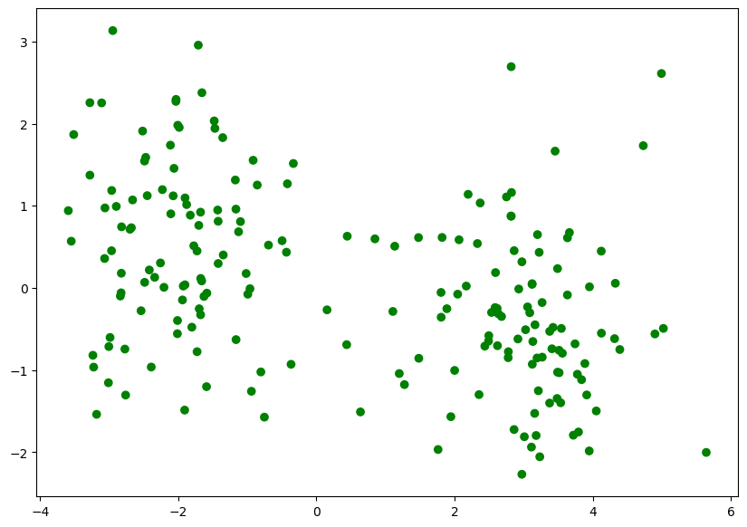
    


```python
from matplotlib.colors import ListedColormap

plt.figure(figsize=(15,8))

eps = 0.1
xx, yy = np.meshgrid(np.linspace(np.min(X_test[:,0]) - eps, np.max(X_test[:,0]) + eps, 200),
                     np.linspace(np.min(X_test[:,1]) - eps, np.max(X_test[:,1]) + eps, 200))
Z = model(torch.FloatTensor(np.c_[xx.ravel(), yy.ravel()]))
Z = Z.reshape(xx.shape).detach().numpy()
Z = (Z>0.5).astype(int)
cmap_light = ListedColormap(['#FFAAAA', '#AAFFAA'])
plt.pcolormesh(xx, yy, Z, cmap=cmap_light)

colored_y = np.zeros(y_test.size, dtype=str)
for i, cl in enumerate([0,1]):
    colored_y[y_test.ravel() == cl] = str(colors[i])

plt.scatter(X_test[:, 0], X_test[:, 1], c=colored_y);
```


    
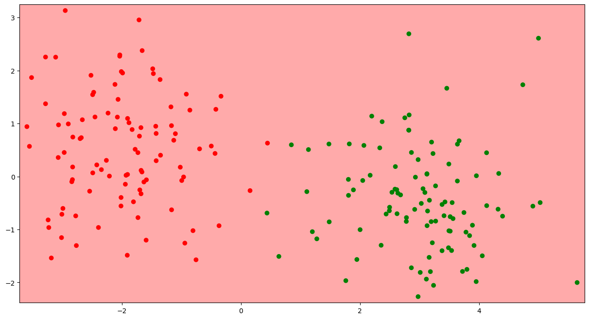
    


## Dataloader и обучение по мини-батчам
Даталоадер принимает на вход данные в виде массива пар [($x_1$, $y_1$), ..., ($x_i$, $y_i$), ...]


```python
train_loader = torch.utils.data.DataLoader(list(zip(X_train, y_train)), batch_size=64, shuffle=True)
test_loader = torch.utils.data.DataLoader(list(zip(X_test, y_test)), batch_size=64, shuffle=False)
```

Здесь:
- batch_size — размер батча, на которые даталоадер будет делить данные перед каждой эпохой;
- shuffle — если True, то перед каждой эпохой и делением на батчи данные будут перемешаны. Shuffle обычно ставится True для обучающих данных, и False для тестовых.

Нам нужно также немного изменить функцию обучения сети, чтобы реализовать обучение по мини-батчам:


```python
import tqdm
from tqdm.auto import tqdm

def train_stochastic(model, loader, criterion, optimizer, num_epoch):
    '''
    args:
        model - модель нейронной сети
        X и y - обучающая выборка
        criterion - функция потерь, взятая из модуля `torch.nn`
        optimizer - оптимизатор, взятый из модуля `torch.optim`
        num_epoch - количество эпох обучения.
    '''
    # цикл по количеству эпох обучения
    for t in tqdm(range(num_epoch)):
        epoch_loss = []

        # цикл по батчам даталоадера
        for X_batch, y_batch in loader:
            # Вычислим предсказания нашей модели
            y_pred = model(X_batch)

            # Посчитаем значение функции потерь  на полученном предсказании
            loss = criterion(y_pred, y_batch)
            epoch_loss.append(loss.item())

            # Выполним подсчёт новых градиентов
            loss.backward()
            # Выполним шаг градиентного спуска
            optimizer.step()
            # Обнулим сохраненные у оптимизатора значения градиентов
            # перед следующим шагом обучения
            optimizer.zero_grad()

        print("curr_loss", np.mean(epoch_loss))

    return model
```


```python
model = Net()

# лосс-функция — бинарная кросс-энтропия (aka LogLoss)
criterion = torch.nn.BCELoss()
# оптимизатор — SGD (Stochastic Gradient Descent)
optimizer = torch.optim.SGD(model.parameters(), lr=1e-3)
# optimizer = torch.optim.Adam(NN.parameters(), lr=1e-4)
```


```python
model = train_stochastic(model, train_loader, criterion, optimizer, 350)
```


      0%|          | 0/350 [00:00<?, ?it/s]


    curr_loss 0.813385546207428
    curr_loss 0.812573853880167
    curr_loss 0.8098752126097679
    curr_loss 0.8105521164834499
    curr_loss 0.8088940717279911
    curr_loss 0.8088412396609783
    curr_loss 0.8066408224403858
    curr_loss 0.806491244584322
    curr_loss 0.8033909387886524
    curr_loss 0.8032841235399246
    curr_loss 0.8012621253728867
    curr_loss 0.8004302009940147
    curr_loss 0.7992707565426826
    curr_loss 0.8006405308842659
    curr_loss 0.799385990947485
    curr_loss 0.7946112677454948
    curr_loss 0.7943521440029144
    curr_loss 0.7945501692593098
    curr_loss 0.7921284660696983
    curr_loss 0.7912062592804432
    curr_loss 0.7894199565052986
    curr_loss 0.7887923829257488
    curr_loss 0.7883731871843338
    curr_loss 0.7879626750946045
    curr_loss 0.7856888435781002
    curr_loss 0.7849929593503475
    curr_loss 0.7836260907351971
    curr_loss 0.7839226499199867
    curr_loss 0.7821205854415894
    curr_loss 0.7815224677324295
    curr_loss 0.7798631973564625
    curr_loss 0.7790429033339024
    curr_loss 0.7785007655620575
    curr_loss 0.7742825970053673
    curr_loss 0.7761899158358574
    curr_loss 0.7738621942698956
    curr_loss 0.7753215357661247
    curr_loss 0.7752658352255821
    curr_loss 0.7717732414603233
    curr_loss 0.7723035030066967
    curr_loss 0.7707249633967876
    curr_loss 0.7704006619751453
    curr_loss 0.7679365649819374
    curr_loss 0.7689111568033695
    curr_loss 0.7680238708853722
    curr_loss 0.7652643658220768
    curr_loss 0.765233401209116
    curr_loss 0.7637579441070557
    curr_loss 0.7624763734638691
    curr_loss 0.7623791918158531
    curr_loss 0.761483259499073
    curr_loss 0.7614426240324974
    curr_loss 0.7612368501722813
    curr_loss 0.757173340767622
    curr_loss 0.7569655068218708
    curr_loss 0.7590936608612537
    curr_loss 0.7556114569306374
    curr_loss 0.7558088190853596
    curr_loss 0.7558470405638218
    curr_loss 0.7546657100319862
    curr_loss 0.7531205527484417
    curr_loss 0.7526383548974991
    curr_loss 0.750494621694088
    curr_loss 0.7512538582086563
    curr_loss 0.7503525130450726
    curr_loss 0.7490871921181679
    curr_loss 0.7488894015550613
    curr_loss 0.7473129779100418
    curr_loss 0.7473250851035118
    curr_loss 0.7466751970350742
    curr_loss 0.7458003461360931
    curr_loss 0.7440279573202133
    curr_loss 0.7440332099795341
    curr_loss 0.7446039840579033
    curr_loss 0.7430558986961842
    curr_loss 0.7431028001010418
    curr_loss 0.7427916005253792
    curr_loss 0.7403004989027977
    curr_loss 0.7388041689991951
    curr_loss 0.738758958876133
    curr_loss 0.7399808317422867
    curr_loss 0.7393189147114754
    curr_loss 0.7365767806768417
    curr_loss 0.7376030869781971
    curr_loss 0.7355746254324913
    curr_loss 0.7357677705585957
    curr_loss 0.734698411077261
    curr_loss 0.7342636808753014
    curr_loss 0.7321015819907188
    curr_loss 0.7335186675190926
    curr_loss 0.7327159196138382
    curr_loss 0.7307610847055912
    curr_loss 0.7306202873587608
    curr_loss 0.7300401516258717
    curr_loss 0.7305194661021233
    curr_loss 0.7295716591179371
    curr_loss 0.7282462641596794
    curr_loss 0.7273300141096115
    curr_loss 0.727601170539856
    curr_loss 0.7266171686351299
    curr_loss 0.7260803878307343
    curr_loss 0.7252824977040291
    curr_loss 0.725128535181284
    curr_loss 0.726104374974966
    curr_loss 0.7238652892410755
    curr_loss 0.7236570604145527
    curr_loss 0.7235436141490936
    curr_loss 0.7220292054116726
    curr_loss 0.7224466912448406
    curr_loss 0.7211555205285549
    curr_loss 0.7209956087172031
    curr_loss 0.7203267514705658
    curr_loss 0.7195722535252571
    curr_loss 0.7200163975358009
    curr_loss 0.7185748480260372
    curr_loss 0.7189307771623135
    curr_loss 0.7180955447256565
    curr_loss 0.7184363789856434
    curr_loss 0.717927061021328
    curr_loss 0.7172847352921963
    curr_loss 0.7165940627455711
    curr_loss 0.7155925631523132
    curr_loss 0.7152713499963284
    curr_loss 0.7140753902494907
    curr_loss 0.713587149977684
    curr_loss 0.7141173668205738
    curr_loss 0.7134813666343689
    curr_loss 0.7124869115650654
    curr_loss 0.7123449631035328
    curr_loss 0.712218776345253
    curr_loss 0.7117522284388542
    curr_loss 0.7096045911312103
    curr_loss 0.7104781083762646
    curr_loss 0.7104933746159077
    curr_loss 0.7103499509394169
    curr_loss 0.7092253640294075
    curr_loss 0.7076813504099846
    curr_loss 0.7072375938296318
    curr_loss 0.7069530077278614
    curr_loss 0.7077614814043045
    curr_loss 0.7077666111290455
    curr_loss 0.7057715877890587
    curr_loss 0.7048885338008404
    curr_loss 0.7059883549809456
    curr_loss 0.7046190947294235
    curr_loss 0.7049449011683464
    curr_loss 0.7043582908809185
    curr_loss 0.7037723138928413
    curr_loss 0.7030450142920017
    curr_loss 0.7034964077174664
    curr_loss 0.7023327648639679
    curr_loss 0.7017664574086666
    curr_loss 0.7017747908830643
    curr_loss 0.7012082897126675
    curr_loss 0.7002156935632229
    curr_loss 0.6998084709048271
    curr_loss 0.7002424672245979
    curr_loss 0.6991191990673542
    curr_loss 0.6984362304210663
    curr_loss 0.6981651447713375
    curr_loss 0.6976294554769993
    curr_loss 0.6977671273052692
    curr_loss 0.6972129382193089
    curr_loss 0.6962709203362465
    curr_loss 0.6965532228350639
    curr_loss 0.6964327767491341
    curr_loss 0.6964042410254478
    curr_loss 0.6953373663127422
    curr_loss 0.6952069364488125
    curr_loss 0.6941502168774605
    curr_loss 0.6943917460739613
    curr_loss 0.6940174251794815
    curr_loss 0.6936147511005402
    curr_loss 0.6934823431074619
    curr_loss 0.692440677434206
    curr_loss 0.6919275522232056
    curr_loss 0.69141760841012
    curr_loss 0.6915005184710026
    curr_loss 0.6920943073928356
    curr_loss 0.6907405853271484
    curr_loss 0.6904564388096333
    curr_loss 0.6897118054330349
    curr_loss 0.6897780671715736
    curr_loss 0.6891730800271034
    curr_loss 0.6888932660222054
    curr_loss 0.6880702264606953
    curr_loss 0.6876841485500336
    curr_loss 0.6871593333780766
    curr_loss 0.687478095293045
    curr_loss 0.6862919852137566
    curr_loss 0.6863935701549053
    curr_loss 0.6859847903251648
    curr_loss 0.6861709579825401
    curr_loss 0.6852530278265476
    curr_loss 0.6847154758870602
    curr_loss 0.6849925518035889
    curr_loss 0.6844322681427002
    curr_loss 0.6840437427163124
    curr_loss 0.6836856082081795
    curr_loss 0.682753961533308
    curr_loss 0.6823397316038609
    curr_loss 0.6820744276046753
    curr_loss 0.6822729036211967
    curr_loss 0.6814578324556351
    curr_loss 0.6808699481189251
    curr_loss 0.6809979118406773
    curr_loss 0.6801124960184097
    curr_loss 0.6800558306276798
    curr_loss 0.6793744936585426
    curr_loss 0.679473914206028
    curr_loss 0.6787188090384007
    curr_loss 0.6785149611532688
    curr_loss 0.678363673388958
    curr_loss 0.6775270216166973
    curr_loss 0.6771126389503479
    curr_loss 0.6764179468154907
    curr_loss 0.6767680794000626
    curr_loss 0.6758124902844429
    curr_loss 0.6761917807161808
    curr_loss 0.675400473177433
    curr_loss 0.6748731061816216
    curr_loss 0.674886729568243
    curr_loss 0.6745295487344265
    curr_loss 0.6739116683602333
    curr_loss 0.6736605428159237
    curr_loss 0.6735824570059776
    curr_loss 0.6727427691221237
    curr_loss 0.6720678173005581
    curr_loss 0.6717095077037811
    curr_loss 0.6715588271617889
    curr_loss 0.6710663214325905
    curr_loss 0.6712332218885422
    curr_loss 0.6707180142402649
    curr_loss 0.6703575365245342
    curr_loss 0.6701085567474365
    curr_loss 0.6694567501544952
    curr_loss 0.6688598245382309
    curr_loss 0.668435599654913
    curr_loss 0.6679184325039387
    curr_loss 0.667299922555685
    curr_loss 0.667414054274559
    curr_loss 0.6672258004546165
    curr_loss 0.6666306145489216
    curr_loss 0.6659306436777115
    curr_loss 0.6661268062889576
    curr_loss 0.6652746088802814
    curr_loss 0.6649231724441051
    curr_loss 0.6644581332802773
    curr_loss 0.6646387279033661
    curr_loss 0.6640638001263142
    curr_loss 0.6629922911524773
    curr_loss 0.6627731695771217
    curr_loss 0.662538681179285
    curr_loss 0.6624803021550179
    curr_loss 0.6621387265622616
    curr_loss 0.6617320217192173
    curr_loss 0.661124661564827
    curr_loss 0.6607553847134113
    curr_loss 0.6600308232009411
    curr_loss 0.6601593419909477
    curr_loss 0.6598292402923107
    curr_loss 0.6594382114708424
    curr_loss 0.6588691473007202
    curr_loss 0.6581787317991257
    curr_loss 0.6579829305410385
    curr_loss 0.6571288704872131
    curr_loss 0.6568249389529228
    curr_loss 0.656708151102066
    curr_loss 0.6564591377973557
    curr_loss 0.6557893566787243
    curr_loss 0.6553065367043018
    curr_loss 0.655534390360117
    curr_loss 0.6548548378050327
    curr_loss 0.6545146889984608
    curr_loss 0.6541876904666424
    curr_loss 0.6534470319747925
    curr_loss 0.653345312923193
    curr_loss 0.652858529239893
    curr_loss 0.6522625163197517
    curr_loss 0.6517301090061665
    curr_loss 0.6510300748050213
    curr_loss 0.6508516035974026
    curr_loss 0.6508411131799221
    curr_loss 0.6499556563794613
    curr_loss 0.649525124579668
    curr_loss 0.6492205932736397
    curr_loss 0.6488434448838234
    curr_loss 0.6483373008668423
    curr_loss 0.6479485146701336
    curr_loss 0.6477431207895279
    curr_loss 0.6471789702773094
    curr_loss 0.6467293165624142
    curr_loss 0.6459958478808403
    curr_loss 0.6456728428602219
    curr_loss 0.645398385822773
    curr_loss 0.6449911035597324
    curr_loss 0.6444289609789848
    curr_loss 0.6440758854150772
    curr_loss 0.6435949988663197
    curr_loss 0.6432523615658283
    curr_loss 0.6427095010876656
    curr_loss 0.6426135748624802
    curr_loss 0.64157510176301
    curr_loss 0.6416295319795609
    curr_loss 0.6410026028752327
    curr_loss 0.6406367979943752
    curr_loss 0.6402267888188362
    curr_loss 0.6397789493203163
    curr_loss 0.6389053650200367
    curr_loss 0.6390440091490746
    curr_loss 0.6382970027625561
    curr_loss 0.6377191171050072
    curr_loss 0.637283843010664
    curr_loss 0.6368544958531857
    curr_loss 0.6364075355231762
    curr_loss 0.6356610506772995
    curr_loss 0.6352837830781937
    curr_loss 0.6351263299584389
    curr_loss 0.6345340050756931
    curr_loss 0.6343273408710957
    curr_loss 0.6334374696016312
    curr_loss 0.6333255171775818
    curr_loss 0.6325513273477554
    curr_loss 0.6321197561919689
    curr_loss 0.6316236965358257
    curr_loss 0.6315162591636181
    curr_loss 0.6305861361324787
    curr_loss 0.6304564513266087
    curr_loss 0.6299349553883076
    curr_loss 0.6291974447667599
    curr_loss 0.6289680898189545
    curr_loss 0.6283263638615608
    curr_loss 0.627547238022089
    curr_loss 0.6272785365581512
    curr_loss 0.6271811611950397
    curr_loss 0.6263122297823429
    curr_loss 0.6260705925524235
    curr_loss 0.6256612874567509
    curr_loss 0.6247609965503216
    curr_loss 0.6247427463531494
    curr_loss 0.6238903701305389
    curr_loss 0.6236382499337196
    curr_loss 0.622990395873785
    curr_loss 0.6222939155995846
    curr_loss 0.6222367398440838
    curr_loss 0.6215802691876888
    curr_loss 0.621113047003746
    curr_loss 0.6205073446035385
    curr_loss 0.6202438026666641
    curr_loss 0.619345773011446
    


```python
from matplotlib.colors import ListedColormap

plt.figure(figsize=(15,8))

eps = 0.1
xx, yy = np.meshgrid(np.linspace(np.min(X_test[:,0]) - eps, np.max(X_test[:,0]) + eps, 200),
                     np.linspace(np.min(X_test[:,1]) - eps, np.max(X_test[:,1]) + eps, 200))

Z = model(torch.FloatTensor(np.c_[xx.ravel(), yy.ravel()]))

Z = Z.reshape(xx.shape).detach().numpy()
Z = (Z>0.5).astype(int)
cmap_light = ListedColormap(['#FFAAAA', '#AAFFAA'])
plt.pcolormesh(xx, yy, Z, cmap=cmap_light)

colored_y = np.zeros(y_test.size, dtype=str)
for i, cl in enumerate([0,1]):
    colored_y[y_test.ravel() == cl] = str(colors[i])

plt.scatter(X_test[:, 0], X_test[:, 1], c=colored_y);
```


    
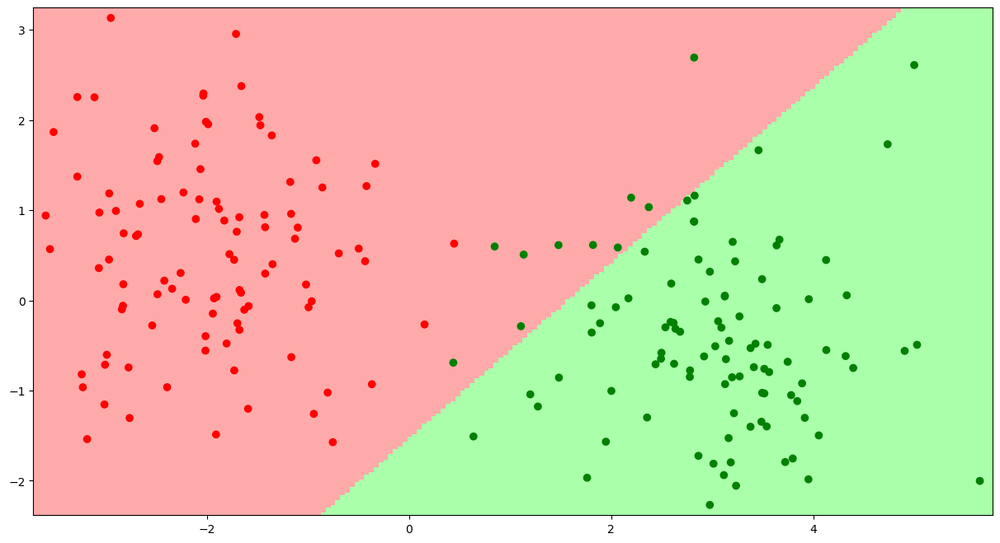
    


## nn.Sequential

В PyTorch есть еще один способ задания структуры нейросети, через nn.Sequential. Выглядит это так:


```python
model = nn.Sequential(
                   nn.Linear(2, 2, bias=True),
                   nn.Sigmoid(),
                   nn.Linear(2, 1, bias=True),
                   nn.Sigmoid()
                   )
```

Теперь с переменной model можно обращаться точно так же, как мы делали это выше. Эту сеть можно обучить и получать ответы на тестовых данных.

Этот способ создания сети выглядит проще (не нужно писать никакой класс и никакой forward), но он менее гибок. Дело в том, что, используя nn.Sequential, мы задаем только слои сети, и выполняться они будут при вызове сети ровно в том порядке, в котором мы их задали. Отсюда и название структуры Sequential — "последовательный". В случае же описания сети в виде класса мы могли в forward определять вид прохождения входа по сети сами. Например, могли бы сделать такую нейросеть:


```python
import torch.nn as nn

class Net(nn.Module):
    def __init__(self):
        super(Net, self).__init__()

        self.fc11 = nn.Linear(2, 2)
        self.act11 = nn.Sigmoid()

        self.fc12 = nn.Linear(2, 2)
        self.act12 = nn.Sigmoid()

        self.fc2 = nn.Linear(4, 1)
        self.act2 = nn.Sigmoid()


    def forward(self, x1, x2):

        x1 = self.fc11(x1)
        x1 = self.act11(x1)

        x2 = self.fc12(x2)
        x2 = self.act12(x2)

        x = torch.cat([x1, x2], dim=1)

        x = self.fc2(x)
        x = self.act2(x)
        return x
```

Или можно даже делать так:


```python
import torch.nn as nn

class Net(nn.Module):
    def __init__(self):
        super(Net, self).__init__()

        self.fc11 = nn.Linear(2, 2)
        self.act11 = nn.Sigmoid()

        self.fc12 = nn.Linear(2, 2)
        self.act12 = nn.Sigmoid()

        self.fc2 = nn.Linear(2, 1)
        self.act2 = nn.Sigmoid()


    def forward(self, x, mode='left'):

        if mode == 'left':
            x = self.fc11(x)
            x = self.act11(x)

        elif mode == 'right':
            x = self.fc12(x2)
            x = self.act12(x2)

        x = self.fc2(x)
        x = self.act2(x)
        return x
```

Таким образом, при задании сети в виде класса у нас ест бОльшая гибкость в определении того, как сеть будет обрабатывать входные данные на каждой новой итерации.

Но, несмотря на это, nn.Sequential все-таки используется при создании сетей. Он часто используется внутри метода init, чтобы сгруппировать несколько слоев сети в блок. Например, вот так:


```python
import torch.nn as nn

class Net(nn.Module):
    def __init__(self):
        super(Net, self).__init__()

        self.left_block = nn.Sequential(
            nn.Linear(2, 2),
            nn.Sigmoid()
        )

        self.right_block = nn.Sequential(
            nn.Linear(2, 2),
            nn.Sigmoid()
        )

        self.bottom_block = nn.Sequential(
            nn.Linear(2, 2),
            nn.Sigmoid()
        )


    def forward(self, x, mode='left'):

        if mode == 'left':
            x = self.left_block(x)

        elif mode == 'right':
            x = self.right_block(x)

        x = self.bottom_block(x)
        return x
```

Это становится особенно удобно при написании глубоких сетей, у которых много слоев.

# Сверточные нейронные сети

## Convolution (свёртка)


То есть мы берём фильтр размера FxF, умножаем его на область изображения размером FxF поэлементно, складываем получившиеся поэлемнетные произведения и записываем это число в результирующий тензор.

За исключением архитектур типа MobileNet, третья размерность фильтра всегда свопадает с третьей размерностью входного тензора. Если картинка размера HxWx3, то фильтр будет иметь размер FxFx3, и поэлементное произведение будет производиться по всему объёму.

Напомним два важных параметра операции свертки:

stride -- это размер шага окна свёртка по осям x и y (обычно совпадают, но вполне могут быть и разными).

$padding$ -- это окружение картинки по краям нулями (или чем-то другим) для того, чтобы придать изображению после свёртки нужный размер (пэддинг делается до свёртки).

Возьмём код из статьи (https://habr.com/post/142818/ ) и посмотрим, как будет меняться картинка в зависимости от фильтра:


```python
from PIL import Image
from math import ceil, sqrt
from math import floor

import matplotlib.pyplot as plt

#https://habrahabr.ru/post/142818/
def checkByte(a):
    if a > 255:
        a = 255
    if a < 0:
        a = 0
    return a
  

def conv(a, b):
    sum = 0
    for i in range(len(a)):
        for j in range(len(a[0])):
            sum += a[i][j] * b[i][j]
    return sum
  

def median(a):
    c = []
    for i in range(len(a)):
        for j in range(len(a[0])):
            c.append(a[i][j])
    c.sort()
    return c[ceil(len(c)/2)]
  

def max(a):
    c = []
    for i in range(len(a)):
        for j in range(len(a[0])):
            c.append(a[i][j])
    c.sort()
    return c[len(c)-1]
  

def min(a):
    c = []
    for i in range(len(a)):
        for j in range(len(a[0])):
            c.append(a[i][j])
    c.sort()
    return c[0]

im = Image.open('./lenna.jpg')
pixels = im.load()

plt.imshow(im);
```


    
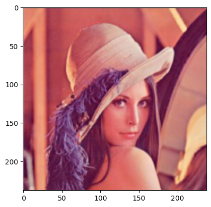
    


```python
imFinal = im.copy()
pixels2 = imFinal.load()
'''filter = [
    [-1, -1, 0, 0, 0],
    [0, -1, -1, -1, 0],
    [0, -1, 9, -1, 0],
    [0, -1, -1, -1, 0],
    [0, 0, 0, 0, 0]
]
'''
'''
filter = [
    [-1, -1, -1, -1, -1],
    [-1, -1, -1, -1, -1],
    [-1, -1, 4, -1, -1],
    [-1, -1, -1, -1, -1],
    [-1, -1, -1, -1, -1]
]
'''

'''
filter = [
    [0, 0, 0, 1, 0, 0, 0],
    [0, 0, 1, 1, 1, 0, 0],
    [0, 1, 1, 1, 1, 1, 0],
    [1, 1, 1, 1, 1, 1, 1],
    [0, 1, 1, 1, 1, 1, 0],
    [0, 0, 1, 1, 1, 0, 0],
    [0, 0, 0, 1, 0, 0, 0]
]

'''
'''
filter = [
    [-1, -1, -1],
    [-1, 9, -1],
    [-1, -1, -1]
]
'''
'''
'''
filter = [
    [0.5, 1.5, 2, 1.5, 0.5],
    [1.5, 3.5, 5, 3.5, 1.5],
    [  2,   5, 10,  5,   2],
    [1.5, 3.5, 5, 3.5, 1.5],
    [0.5, 1.5, 2, 1.5, 0.5]
]


div = 0
for i in range(len(filter)):
    for j in range(len(filter[0])):
        div += filter[i][j]
if div == 0:
    div = 1

for i in range(floor(len(filter)/2), im.width - floor(len(filter)/2)):
    for j in range(floor(len(filter)/2), im.height - floor(len(filter)/2)):
        matrR = []
        matrG = []
        matrB = []
        for n in range(-floor(len(filter)/2), ceil(len(filter)/2)):
            rowR = []
            rowG = []
            rowB = []
            for m in range(-floor(len(filter)/2), ceil(len(filter)/2)):
                r, g, b = pixels[i + n, j + m]
                rowR.append(r)
                rowG.append(g)
                rowB.append(b)
            matrR.append(rowR)
            matrG.append(rowG)
            matrB.append(rowB)

        r = checkByte(round(conv(matrR, filter) / div))
        g = checkByte(round(conv(matrG, filter) / div))
        b = checkByte(round(conv(matrB, filter) / div))

       # r = checkByte(min(matrR))
       # g = checkByte(min(matrG))
       # b = checkByte(min(matrB))
        '''
        if r < 512:
            pixels2[i, j] = (255, 255, 255)
        else:
            pixels2[i, j] = (0, 0, 0)'''
        pixels2[i, j] = (r, g, b)

plt.imshow(imFinal);
```


    

    


Задача 1

Вычислить размер результата после применения свёртки, $I$ -- размеры входного изображения, $f$ -- размеры фильтра:

1. Пример: $I$ = (50, 50, 3), $f$ = (3, 3), $stride$ = 1. Вычисляем:
* по ширине: 50 - 3 + 1 = 48,  
* по высоте: 50 - 3 + 1 = 48,   
то есть размер результата будет (48, 48)

2. $I$ = (1024, 768, 3), $f$=(5,5), $stride$ = 2. Вычисляем:


Из рисунка видно, что выходная ширина равна количеству нечентых чисел от 1 до 1020, т. е. 510

Аналогично по высоте получаем 382, то есть размер результата будет (510, 382).

Выведите общую формулу для $I$ = (H, W, C), $f$=(F, F) (фильтры обычно всё же квадратные)

### **Формулы свёртки**

Высота выхода:

$H_{\text{out}} = \left\lfloor \frac{H - F}{S} \right\rfloor + 1$

Ширина выхода:

$W_{\text{out}} = \left\lfloor \frac{W - F}{S} \right\rfloor + 1$

Размер выходного тензора (если фильтров K):

$(H_{\text{out}},\ W_{\text{out}},\ K)$


### **Формулы свёртки с padding**

При входе размера:

$ I = (H, W, C) $

Квадратном фильтре размера:

$ F \times F $

Padding:

$ p $

И шаге (stride):

$ S $

Размеры выходного тензора вычисляются так:

Высота:

$$ H_{\text{out}} = \left\lfloor \frac{H - F + 2p}{S} \right\rfloor + 1 $$

Ширина:

$$ W_{\text{out}} = \left\lfloor \frac{W - F + 2p}{S} \right\rfloor + 1 $$

Если фильтров $K$, итоговая форма результата:

$$ (H_{\text{out}},\ W_{\text{out}},\ K) $$


## Pooling

Pooling (пулинг) -- операция, нужная для уменьшения размерности по ширине и по высоте. Можно брать очень много операций в качестве пулинга, например, минимум из элементов, максимум, среднее, сумму и т.д.

Обычно используется max- и avg-pooling.

Пример применения max-pooling'а:


Примеры применения max и avg pooling'ов:


## Subclassing nn.Module


```python
import torch
from torch import nn
import torch.nn.functional as F
import pandas as pd
import numpy as np
from sklearn.model_selection import train_test_split
from matplotlib import pyplot as plt
```


```python
# код для генерации взят из Стэнфордсокго курса:
# http://cs231n.github.io/neural-networks-case-study/#linear

N = 100
D = 2
K = 3
X = np.zeros((N * K, D))
y = np.zeros(N * K, dtype='uint8')

for j in range(K):
    ix = range(N * j,N * (j + 1))
    r = np.linspace(0.0, 1, N)
    t = np.linspace(j * 4, (j + 1) * 4,N) + np.random.randn(N) * 0.2 # theta
    X[ix] = np.c_[r * np.sin(t), r * np.cos(t)]
    y[ix] = j
```


```python
# Отрисовочная магия, снова взято из:
# http://cs231n.github.io/neural-networks-case-study/#linear

plt.figure(figsize=(10, 8))

plt.scatter(X[:, 0], X[:, 1], c=y, s=40, cmap=plt.cm.rainbow)

plt.title('Игрушка дьявола', fontsize=15)
plt.xlabel('$x$', fontsize=14)
plt.ylabel('$y$', fontsize=14)
plt.show();
```


    
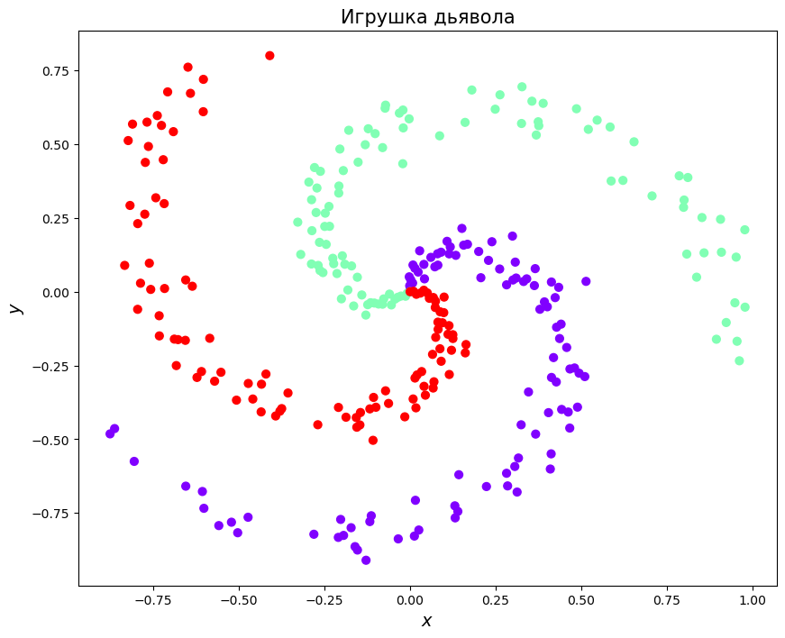
    


```python
#Приведение данных к тензору, для работы в пайторче
X = torch.FloatTensor(X) #Действительные числа - флоат тензер
y = torch.LongTensor(y) # Метки классов - можно лонг тензер 
```

Сейчас мы хотим научиться самостоятельно создавать наследников nn.Module. До этого мы делали нейросети с помощью класса nn.Sequential, попробуем построить такую же сеть, как на прошлом семинаре, но самостоятельно.


```python
# D_in - размерность входа (количество признаков у объекта);
# H - размерность скрытых слоёв; 
# D_out - размерность выходного слоя (суть - количество классов)
D_in, H, D_out = 2, 100, 3

# Use the nn package to define our model and loss function.
two_layer_net = torch.nn.Sequential(
    torch.nn.Linear(D_in, H),
    torch.nn.ReLU(),
    torch.nn.Linear(H, D_out),
    torch.nn.Softmax()
)
```

Что такое модуль и как он устроен? Во-первых, модуль это такой строительный блок для нейронок, с помощью модуля можно задать любую дифференциируемую по своему параметру функцию. Применяются модули так же, как и обычные функции с синтаксисом
> module_instance(var1, var2)

При этом внутри вызывается функция forward с теми же аргументами, а ее выход возвращается как результат вызова модуля. Зачем же нужно так странно оборачивать обычные функции в модули? 

* Это позволяет очень удобно следить за параметрами, которые надо изменять. Когда мы хоти получить все параметры можно просто рекурсивно пройтись по всем полям модели, посмотреть, какие из ни параметры сами по себе, а какие являются модулями и содрежат параметры внутри, а потом все это собрать. 

_По этой причине если вы используете внутри своего модуля какие-то еще модули их надо класть просто в поле класса, если это единичный модуль, и в класс **nn.ModuleList** или **nn.ModuleDict**, если у вас список или словарь используемых модулей. Если же в модели у вас есть како-то собственный вес, то недостаточно положить тензор в поле класса, его надо обернуть в **nn.Parameter, nn.ParameterList** или **nn.ParameterDict** в зависимотси от того, что именно у вас._

* Такая организация позволяет достаточно безболезненно расширять PyTorch и писать для него свои функции, которые нельзя выразить композицией уже существующих. Пригождается это редко, поэтому сегодня мы не будем писать свое расширение.

* Код, разделенный на модули, это просто красиво.


```python
# НОВАЯ СЕТЬ

class MyModule(nn.Module):
    def __init__(self):
        super().__init__()
        self.f_lin = nn.Linear(D_in, H)
        self.s_lin = nn.Linear(H, D_out)
        
    def forward(self, X):
        X = F.relu(self.f_lin(X))
        return self.s_lin(X)
    
model = MyModule()
loss_fn = nn.CrossEntropyLoss()
optim = torch.optim.Adam(model.parameters(), 1e-1)
```

Поговорим немного подробнее о `softmax` и `CrossEntropyLoss`. 

Напоминание: softmax-функция выглядит следующим образом
$$Softmax(x) = \begin{pmatrix} 
\dfrac{e^{x_1}}{\sum\limits_{i=0}^{m} e^{x_i}},\; \dots,\; \dfrac{e^{x_m}}{\sum\limits_{i=0}^{m} e^{x_i}}
\end{pmatrix} $$

Таким образом, после применения softmax-функции мы получили вектор чисел из интервала $(0, 1)$, которые мы будем интерпретировать как вероятности классов.

Аналогично тому, как мы обощили сигмоиду на многоклассовый случай и получили softmax, можно обобщить и функцию потерь, получив _кросс-энтропию_:

$$CrossEntropy(x) = -\sum\limits_{i=0}^m y_i \cdot log(Softmax(x)_i), $$

где $y_i$ – истинная метка класса ($1$ если $x$ принадлежит $i$-ому классу и $0$ иначе)


```python
losses = []
for t in range(100):
    # forward
    y_pred = model(X)

    # loss
    loss = loss_fn(y_pred, y)
    losses.append(loss.item())

    optim.zero_grad()
    loss.backward()
    optim.step()
    
plt.plot(losses)
```


    [<matplotlib.lines.Line2D at 0x210b4a0e530>]


    
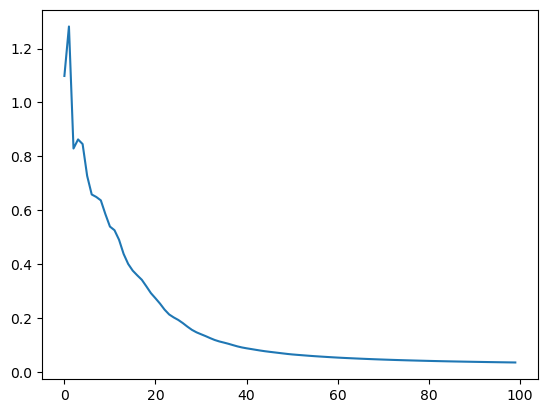
    


```python
# Сеть без параметров

class MyModule(nn.Module):
    def __init__(self):
        super().__init__()
        self.linear_layers = [nn.Linear(D_in, H), nn.Linear(H, D_out)]
        self.my_useless_bias = torch.ones(1, H, requires_grad=True)
        self.more_of_my_useless_biases = [
            torch.ones(1, H, requires_grad=True),
            torch.ones(1, H, requires_grad=True),
            torch.ones(1, H, requires_grad=True)
        ]
        
    def forward(self, X):
        X = F.relu(self.linear_layers[0](X))
        X += self.my_useless_bias
        return F.softmax(self.linear_layers[1](X))
    
model = MyModule()
list(model.parameters())
```


    []


Как мы и ожидали параметров нет. Исправим это.


```python
# Исправленная сеть с параметрами

class MyModule(nn.Module):
    def __init__(self):
        super().__init__()
        self.linear_layers = nn.ModuleList([nn.Linear(D_in, H), nn.Linear(H, D_out)])
        self.my_useless_bias = nn.Parameter(torch.ones(1, H, requires_grad=True))
        self.more_of_my_useless_biases = nn.ParameterList([
            nn.Parameter(torch.ones(1, H, requires_grad=True)),
            nn.Parameter(torch.ones(1, H, requires_grad=True)),
            nn.Parameter(torch.ones(1, H, requires_grad=True))
        ])
        
    def forward(self, X):
        X = F.relu(self.linear_layers[0](X))
        X += self.my_useless_bias
        for b in self.more_of_my_useless_biases:
            X += b
        return F.softmax(self.linear_layers[1](X))
    
model = MyModule()
list(model.parameters())
```


    [Parameter containing:
     tensor([[1., 1., 1., 1., 1., 1., 1., 1., 1., 1., 1., 1., 1., 1., 1., 1., 1., 1.,
              1., 1., 1., 1., 1., 1., 1., 1., 1., 1., 1., 1., 1., 1., 1., 1., 1., 1.,
              1., 1., 1., 1., 1., 1., 1., 1., 1., 1., 1., 1., 1., 1., 1., 1., 1., 1.,
              1., 1., 1., 1., 1., 1., 1., 1., 1., 1., 1., 1., 1., 1., 1., 1., 1., 1.,
              1., 1., 1., 1., 1., 1., 1., 1., 1., 1., 1., 1., 1., 1., 1., 1., 1., 1.,
              1., 1., 1., 1., 1., 1., 1., 1., 1., 1.]], requires_grad=True),
     Parameter containing:
     tensor([[-0.0110,  0.4890],
             [ 0.6894, -0.2851],
             [-0.0720,  0.1569],
             [-0.6740, -0.6149],
             [-0.3672,  0.4626],
             [ 0.4606, -0.2878],
             [ 0.5432, -0.6713],
             [ 0.2055,  0.1981],
             [-0.2464,  0.4557],
             [-0.1585,  0.3181],
             [-0.5407, -0.2762],
             [ 0.6240, -0.0676],
             [-0.2673, -0.2304],
             [ 0.6640,  0.1988],
             [-0.6159, -0.4859],
             [ 0.1603, -0.4902],
             [-0.6359, -0.5612],
             [-0.2616,  0.4186],
             [ 0.0957,  0.0402],
             [-0.4758, -0.4628],
             [ 0.0527, -0.5684],
             [ 0.3558, -0.2610],
             [-0.0017,  0.5819],
             [ 0.3991,  0.5009],
             [ 0.1573, -0.4693],
             [-0.5251,  0.6578],
             [-0.3653,  0.3561],
             [-0.6393, -0.2159],
             [-0.2853, -0.6979],
             [ 0.0550, -0.3687],
             [ 0.5981,  0.4955],
             [-0.5879,  0.6050],
             [ 0.0022, -0.2102],
             [-0.3504,  0.6562],
             [-0.5697, -0.5932],
             [-0.4992,  0.6650],
             [-0.5767,  0.3951],
             [-0.4179,  0.3386],
             [-0.3067, -0.0306],
             [ 0.2604,  0.1220],
             [ 0.0919,  0.5882],
             [-0.4071,  0.5179],
             [ 0.5804,  0.5723],
             [ 0.2566, -0.2026],
             [-0.5328, -0.2333],
             [ 0.4239,  0.5247],
             [-0.2507,  0.6476],
             [ 0.4910, -0.0071],
             [-0.1949,  0.1098],
             [ 0.0839, -0.0099],
             [-0.4542, -0.6031],
             [-0.1477,  0.6907],
             [ 0.1766, -0.0200],
             [-0.1459, -0.6291],
             [-0.4925, -0.2698],
             [ 0.6457, -0.2724],
             [-0.1810, -0.0411],
             [ 0.0342, -0.4377],
             [ 0.7066, -0.3351],
             [-0.2009, -0.2358],
             [ 0.1913, -0.3500],
             [-0.1684,  0.5175],
             [-0.4956, -0.0190],
             [-0.7069,  0.2937],
             [-0.5350,  0.0179],
             [-0.4484,  0.4101],
             [ 0.4788, -0.6792],
             [-0.3003,  0.6056],
             [-0.6495,  0.1890],
             [-0.5856,  0.3589],
             [-0.7000, -0.2206],
             [ 0.2439, -0.1322],
             [-0.4766,  0.1405],
             [ 0.1226,  0.6823],
             [ 0.0727, -0.3516],
             [ 0.1534,  0.1795],
             [-0.5106,  0.3869],
             [ 0.0299, -0.2874],
             [ 0.4014, -0.5101],
             [-0.4644,  0.4299],
             [ 0.2429,  0.2638],
             [-0.4069,  0.4806],
             [ 0.6971,  0.1951],
             [-0.5687,  0.2457],
             [-0.4298,  0.2477],
             [-0.0584,  0.1034],
             [-0.6038,  0.3765],
             [ 0.3354, -0.2634],
             [-0.2308,  0.6130],
             [ 0.4164, -0.5549],
             [ 0.3678,  0.4277],
             [ 0.6369, -0.6324],
             [-0.0137,  0.7043],
             [ 0.3661,  0.5885],
             [-0.0680,  0.4253],
             [ 0.3789, -0.0983],
             [ 0.0880, -0.5274],
             [ 0.3912, -0.6583],
             [ 0.0932,  0.3208],
             [-0.0917,  0.0366]], requires_grad=True),
     Parameter containing:
     tensor([ 2.1266e-01,  3.5589e-01, -5.3645e-01,  2.2991e-01, -4.7858e-01,
             -3.2821e-01, -6.4424e-01,  2.5722e-01,  5.6814e-02,  3.4528e-01,
              1.7224e-01,  4.1995e-01,  5.1930e-01,  2.6191e-02, -1.7549e-01,
              3.2962e-01,  2.1214e-01,  4.6084e-01,  6.1281e-01, -5.2560e-01,
              3.3689e-01,  2.3315e-01, -1.8492e-02, -2.4925e-02, -2.0903e-01,
             -5.9643e-01,  5.2582e-01,  1.2827e-01,  2.9895e-01,  3.2068e-01,
             -4.3013e-01,  6.6472e-01, -3.7359e-01,  3.0455e-01, -6.1635e-01,
              6.4807e-01,  8.6422e-02, -6.8540e-02,  4.2184e-01,  2.4414e-01,
              2.1261e-01,  3.0757e-01,  4.0585e-01,  3.5101e-01, -2.8259e-01,
             -4.6626e-01, -8.6584e-02,  2.3765e-01,  1.6922e-01,  1.7097e-01,
             -5.1440e-02,  6.8506e-01,  3.3823e-01, -4.3583e-01, -3.3059e-01,
              1.4326e-01,  5.1628e-03,  1.2071e-01, -1.3568e-01,  4.0271e-01,
             -5.1981e-01,  4.3092e-01,  4.7274e-01, -6.2702e-01, -3.3413e-01,
             -6.9499e-02,  2.0527e-01,  4.5948e-01,  5.6151e-01,  6.2576e-02,
              5.2294e-01, -2.9985e-01,  5.1483e-01, -6.6608e-02,  5.8097e-04,
              5.7842e-01, -5.6128e-01, -1.8654e-01, -2.7782e-01, -5.6587e-01,
             -2.7260e-01, -2.4022e-01,  5.3642e-01, -4.4731e-01, -2.2862e-01,
              3.8740e-01, -1.9139e-01, -6.6657e-01,  2.2260e-01,  2.8048e-01,
              4.4052e-01, -5.4683e-01,  3.9106e-01, -9.7556e-02,  5.6909e-03,
             -2.6780e-02, -3.6624e-01, -3.3183e-01,  3.3073e-02, -6.7248e-01],
            requires_grad=True),
     Parameter containing:
     tensor([[-6.5237e-02, -3.4468e-02, -5.5309e-02, -8.8991e-02, -2.8907e-02,
              -2.9258e-02, -9.4436e-02, -8.3643e-02,  9.0924e-02,  9.3836e-02,
               5.3631e-02, -6.7930e-02, -1.7111e-02, -4.2614e-02, -4.9732e-02,
               4.6323e-02, -1.7476e-03,  3.0638e-02,  8.8667e-02, -3.7595e-02,
               1.0272e-02,  4.5620e-02,  1.8123e-02, -8.0996e-02,  7.0869e-02,
               9.9080e-02, -4.8180e-04,  6.1451e-02,  2.0607e-02, -9.8934e-02,
               4.8268e-02, -5.4645e-02,  1.3366e-02,  8.3658e-02,  6.1196e-02,
              -3.0507e-02,  4.1545e-02,  6.4360e-02,  6.8542e-03, -4.2219e-02,
              -7.4333e-02,  8.9751e-02,  9.3082e-02, -2.6640e-02, -4.9276e-02,
              -9.9574e-03,  2.1808e-02,  2.7126e-02, -7.8848e-02,  8.7637e-03,
               2.1042e-02, -5.1352e-02, -9.3250e-02, -2.8833e-02,  7.2798e-02,
              -9.9532e-02, -8.6805e-02, -3.1003e-03, -4.9158e-02,  4.8841e-02,
               9.5263e-02,  6.3087e-02, -2.8158e-02,  2.4912e-02, -4.1071e-02,
               7.4434e-02, -7.1288e-02,  8.6046e-02,  2.2636e-02,  6.8659e-02,
               3.4798e-02,  1.7791e-02, -7.8480e-02, -6.4354e-03, -8.5003e-03,
               3.6525e-03,  3.7107e-02,  5.4560e-02, -2.5789e-02,  7.8594e-02,
               9.4481e-02, -6.0656e-02,  9.8539e-02, -9.8116e-02,  3.6645e-02,
              -7.2126e-02,  6.5842e-02, -3.5568e-02, -3.2037e-02, -5.9830e-03,
               9.5236e-02, -4.9169e-03, -1.1711e-02, -6.4229e-02, -9.8115e-02,
               4.7299e-02, -3.0945e-02, -2.7408e-02, -2.4245e-02,  5.6286e-03],
             [ 6.4477e-02,  8.3772e-02, -4.9746e-02, -9.1539e-03, -3.8956e-02,
              -4.2496e-02,  1.3355e-02, -3.7954e-02, -8.6572e-02,  7.6593e-02,
               4.2469e-02,  9.4818e-02, -3.1366e-02,  7.8006e-02, -5.9191e-02,
              -5.0016e-02,  7.4360e-02, -5.8253e-02, -6.9078e-02,  3.1684e-02,
               1.6461e-02, -5.3029e-02, -2.8925e-02, -6.1868e-02,  8.1941e-02,
              -1.4827e-02, -1.2977e-02,  2.5560e-02, -8.8420e-02,  9.8226e-02,
               6.9800e-02, -9.7855e-02, -1.0928e-03, -9.5862e-02, -4.2115e-02,
              -4.6529e-02,  5.8250e-02, -7.5472e-03, -2.7881e-02, -9.3310e-02,
               3.0732e-02,  9.8378e-02, -8.3740e-02,  9.9693e-02, -7.7694e-02,
              -8.1318e-02,  7.7226e-02,  5.1468e-03,  4.5550e-02, -4.6621e-02,
              -8.4643e-02,  1.4071e-02,  2.3542e-02,  1.2174e-02,  9.6899e-02,
               4.5910e-02, -4.6797e-02, -1.8733e-02, -6.6256e-02,  1.1654e-02,
               2.9201e-02, -1.9073e-02,  3.3472e-02,  5.7659e-03,  8.9676e-02,
              -7.3902e-04, -9.5977e-02, -9.5632e-04, -3.5970e-02, -2.2636e-02,
              -6.1304e-02, -2.0863e-02, -6.2659e-02,  4.1814e-02, -9.8189e-02,
               7.5346e-02,  2.0382e-02,  1.6967e-02,  3.5545e-02,  4.5501e-02,
               8.6442e-03, -1.3914e-02,  6.2316e-02, -7.3240e-02, -6.1831e-02,
               6.3627e-02,  7.0964e-02, -5.7527e-02, -3.7691e-02, -5.4413e-02,
              -5.8772e-02,  7.0931e-02,  3.2503e-02,  3.7864e-02,  1.5462e-02,
               1.3149e-02,  7.0900e-02, -7.8251e-02,  5.9395e-02,  1.7907e-02],
             [ 8.1255e-02,  5.1438e-02, -1.3664e-02, -3.7388e-03,  5.2822e-02,
              -4.8294e-02, -6.3576e-03,  6.5920e-02,  6.2503e-02,  5.1127e-02,
               6.6773e-02,  6.0449e-02,  4.6673e-02,  7.7368e-02,  3.3194e-02,
               5.7563e-03,  7.4283e-02, -4.2271e-02, -9.7814e-02, -8.0172e-03,
               7.7746e-02,  4.8675e-02,  7.6129e-03, -3.4318e-02,  3.8017e-02,
              -9.2927e-02, -9.3242e-02, -9.0016e-04, -8.3511e-02,  4.1727e-02,
               9.8574e-02,  4.9004e-02,  5.1570e-02, -2.8520e-02, -4.6712e-02,
              -3.3297e-02,  7.2236e-02,  3.8212e-02,  9.0405e-02,  3.9732e-02,
               4.2035e-02,  9.4511e-05, -5.9325e-02, -6.1010e-02, -3.3468e-02,
              -9.3826e-02, -7.8642e-02,  2.9281e-05,  9.4442e-02, -7.7800e-02,
              -2.2979e-02, -6.3281e-02,  7.9893e-03,  8.0026e-02,  6.6800e-02,
               2.0793e-02,  7.2749e-03, -3.8391e-02, -8.9723e-02, -9.5596e-02,
               4.4471e-03,  7.4431e-02, -9.0829e-02,  3.3629e-02, -2.6980e-03,
               2.8021e-02,  7.8609e-02, -7.2502e-02, -5.1482e-02,  8.5550e-02,
               1.7310e-02,  4.0273e-02, -2.3872e-02, -4.2747e-02,  7.4736e-02,
               2.4523e-02,  4.9619e-02,  6.7887e-02, -1.9114e-02, -6.4222e-02,
              -4.2374e-02, -1.5156e-02,  8.0735e-02, -5.2859e-02, -7.9826e-05,
              -3.6224e-03,  1.2075e-02, -8.3806e-02, -9.5399e-02,  5.5936e-03,
              -9.2309e-03,  4.7241e-02, -3.4440e-02, -6.2893e-02,  5.3267e-03,
              -9.1828e-02, -8.7852e-02,  3.5659e-02,  8.9144e-02, -1.4692e-02]],
            requires_grad=True),
     Parameter containing:
     tensor([ 0.0053, -0.0546, -0.0190], requires_grad=True),
     Parameter containing:
     tensor([[1., 1., 1., 1., 1., 1., 1., 1., 1., 1., 1., 1., 1., 1., 1., 1., 1., 1.,
              1., 1., 1., 1., 1., 1., 1., 1., 1., 1., 1., 1., 1., 1., 1., 1., 1., 1.,
              1., 1., 1., 1., 1., 1., 1., 1., 1., 1., 1., 1., 1., 1., 1., 1., 1., 1.,
              1., 1., 1., 1., 1., 1., 1., 1., 1., 1., 1., 1., 1., 1., 1., 1., 1., 1.,
              1., 1., 1., 1., 1., 1., 1., 1., 1., 1., 1., 1., 1., 1., 1., 1., 1., 1.,
              1., 1., 1., 1., 1., 1., 1., 1., 1., 1.]], requires_grad=True),
     Parameter containing:
     tensor([[1., 1., 1., 1., 1., 1., 1., 1., 1., 1., 1., 1., 1., 1., 1., 1., 1., 1.,
              1., 1., 1., 1., 1., 1., 1., 1., 1., 1., 1., 1., 1., 1., 1., 1., 1., 1.,
              1., 1., 1., 1., 1., 1., 1., 1., 1., 1., 1., 1., 1., 1., 1., 1., 1., 1.,
              1., 1., 1., 1., 1., 1., 1., 1., 1., 1., 1., 1., 1., 1., 1., 1., 1., 1.,
              1., 1., 1., 1., 1., 1., 1., 1., 1., 1., 1., 1., 1., 1., 1., 1., 1., 1.,
              1., 1., 1., 1., 1., 1., 1., 1., 1., 1.]], requires_grad=True),
     Parameter containing:
     tensor([[1., 1., 1., 1., 1., 1., 1., 1., 1., 1., 1., 1., 1., 1., 1., 1., 1., 1.,
              1., 1., 1., 1., 1., 1., 1., 1., 1., 1., 1., 1., 1., 1., 1., 1., 1., 1.,
              1., 1., 1., 1., 1., 1., 1., 1., 1., 1., 1., 1., 1., 1., 1., 1., 1., 1.,
              1., 1., 1., 1., 1., 1., 1., 1., 1., 1., 1., 1., 1., 1., 1., 1., 1., 1.,
              1., 1., 1., 1., 1., 1., 1., 1., 1., 1., 1., 1., 1., 1., 1., 1., 1., 1.,
              1., 1., 1., 1., 1., 1., 1., 1., 1., 1.]], requires_grad=True)]


Как мы и хотели, все параметры появились

# MNIST

***Свёрточная нейросеть (Convolutional Neural Network, CNN)*** - это многослойная нейросеть, имеющая в своей архитектуре помимо *полносвязных слоёв* (а иногда их может и не быть) ещё и **свёрточные слои (Conv Layers)** и **pooling-слои (Pool Layers)**.  

Собственно, название такое эти сети получили потому, что в основе их работы лежит операция **свёртки**. 


Сразу же стоит сказать, что свёрточные нейросети **были придуманы прежде всего для задач, связанных с картинками**, следовательно, на вход они тоже "ожидают" картинку.

Расмотрим их устройство более подробно:

Свёрточные нейросети (обыкновенные, есть и намного более продвинутые) почти всегда строятся по следующему правилу:  

`INPUT -> [[CONV -> RELU]*N -> POOL?]*M -> [FC -> RELU]*K -> FC`  

то есть:  

1). ***Входной слой*** (batch картинок `HxWxC`)  

2). $M$ блоков (M $\ge$ 0) из свёрток и pooling-ов, причём именно в том порядке, как в формуле выше. Все эти $M$ блоков вместе называют ***feature extractor*** свёрточной нейросети, потому что эта часть сети отвечает непосредственно за формирование новых, более сложных признаков, поверх тех, которые подаются (то есть, по аналогии с MLP, мы опять же переходим к новому признаковому пространству, однако здесь оно строится сложнее, чтем в обычных многослойных сетях, поскольку используется операция свёртки)  

3). $K$ штук FullyConnected-слоёв (с активациями). Эту часть из $K$ FC-слоёв называют ***classificator***, поскольку эти слои отвечают непосредственно за предсказание нужно класса (сейчас рассматривается задача классификации изображений).


<h3 style="text-align: center;"><b>Свёрточная нейросеть на PyTorch</b></h3>

Ешё раз напомним про основные компоненты нейросети:

- непосредственно, сама **архитектура** нейросети (сюда входят типы функций активации у каждого нейрона);
- начальная **инициализация** весов каждого слоя;
- метод **оптимизации** нейросети (сюда ещё входит метод изменения `learning_rate`);
- размер **батчей** (`batch_size`);
- количетсво итераций обучения (`num_epochs`);
- **функция потерь** (`loss`);  
- тип **регуляризации** нейросети (для каждого слоя можно свой);  

То, что связано с ***данными и задачей***:  
- само **качество** выборки (непротиворечивость, чистота, корректность постановки задачи);  
- **размер** выборки;  

Так как мы сейчас рассматриваем **архитектуру CNN**, то, помимо этих компонент, в свёрточной нейросети можно настроить следующие вещи:  

- (в каждом ConvLayer) **размер фильтров (окна свёртки)** (`kernel_size`)
- (в каждом ConvLayer) **количество фильтров** (`out_channels`)  
- (в каждом ConvLayer) размер **шага окна свёртки (stride)** (`stride`)  
- (в каждом ConvLayer) **тип padding'а** (`padding`)  


- (в каждом PoolLayer) **размер окна pooling'a** (`kernel_size`)  
- (в каждом PoolLayer) **шаг окна pooling'а** (`stride`)  
- (в каждом PoolLayer) **тип pooling'а** (`pool_type`)  
- (в каждом PoolLayer) **тип padding'а** (`padding`)


```python
import torch
import torchvision
from torchvision import transforms
from torchsummary import summary

import numpy as np
import matplotlib.pyplot as plt  # для отрисовки картиночек
%matplotlib inline

# Проверяем, доступны ли GPU
device = 'cuda' if torch.cuda.is_available() else 'cpu'
```


**MNIST:** это набор из 70k картинок рукописных цифр от 0 до 9, написанных людьми, 60k из которых являются тренировочной выборкой (`train` dataset)), и ещё 10k выделены для тестирования модели (`test` dataset).

Скачаем и загрузим в `loader`'ы:


```python
transform = transforms.Compose(
    [transforms.ToTensor()])

trainset = torchvision.datasets.MNIST(root='./data', train=True, 
                                      download=True, transform=transform)
trainloader = torch.utils.data.DataLoader(trainset, batch_size=4,
                                          shuffle=True, num_workers=2) 
#num_workers - Количество рабочих процессов, которые параллельно будут загружать данные. 
#0 - всё грузится в основном процессе. 2 - два подпроцесса отвечают за загрузку/преобразование батчей

testset = torchvision.datasets.MNIST(root='./data', train=False,
                                     download=True, transform=transform)
testloader = torch.utils.data.DataLoader(testset, batch_size=4,
                                         shuffle=False, num_workers=2)

classes = tuple(str(i) for i in range(10))
```

Сами данные лежат в полях `trainloader.dataset.train_data` и `testloader.dataset.test_data`:


```python
trainloader.dataset.data.shape #изображения черно-белые, поэтому нет третьей размерности
```


    torch.Size([60000, 28, 28])


```python
testloader.dataset.data.shape
```


    torch.Size([10000, 28, 28])


```python
trainloader.dataset.data[0]
```


    tensor([[  0,   0,   0,   0,   0,   0,   0,   0,   0,   0,   0,   0,   0,   0,
               0,   0,   0,   0,   0,   0,   0,   0,   0,   0,   0,   0,   0,   0],
            [  0,   0,   0,   0,   0,   0,   0,   0,   0,   0,   0,   0,   0,   0,
               0,   0,   0,   0,   0,   0,   0,   0,   0,   0,   0,   0,   0,   0],
            [  0,   0,   0,   0,   0,   0,   0,   0,   0,   0,   0,   0,   0,   0,
               0,   0,   0,   0,   0,   0,   0,   0,   0,   0,   0,   0,   0,   0],
            [  0,   0,   0,   0,   0,   0,   0,   0,   0,   0,   0,   0,   0,   0,
               0,   0,   0,   0,   0,   0,   0,   0,   0,   0,   0,   0,   0,   0],
            [  0,   0,   0,   0,   0,   0,   0,   0,   0,   0,   0,   0,   0,   0,
               0,   0,   0,   0,   0,   0,   0,   0,   0,   0,   0,   0,   0,   0],
            [  0,   0,   0,   0,   0,   0,   0,   0,   0,   0,   0,   0,   3,  18,
              18,  18, 126, 136, 175,  26, 166, 255, 247, 127,   0,   0,   0,   0],
            [  0,   0,   0,   0,   0,   0,   0,   0,  30,  36,  94, 154, 170, 253,
             253, 253, 253, 253, 225, 172, 253, 242, 195,  64,   0,   0,   0,   0],
            [  0,   0,   0,   0,   0,   0,   0,  49, 238, 253, 253, 253, 253, 253,
             253, 253, 253, 251,  93,  82,  82,  56,  39,   0,   0,   0,   0,   0],
            [  0,   0,   0,   0,   0,   0,   0,  18, 219, 253, 253, 253, 253, 253,
             198, 182, 247, 241,   0,   0,   0,   0,   0,   0,   0,   0,   0,   0],
            [  0,   0,   0,   0,   0,   0,   0,   0,  80, 156, 107, 253, 253, 205,
              11,   0,  43, 154,   0,   0,   0,   0,   0,   0,   0,   0,   0,   0],
            [  0,   0,   0,   0,   0,   0,   0,   0,   0,  14,   1, 154, 253,  90,
               0,   0,   0,   0,   0,   0,   0,   0,   0,   0,   0,   0,   0,   0],
            [  0,   0,   0,   0,   0,   0,   0,   0,   0,   0,   0, 139, 253, 190,
               2,   0,   0,   0,   0,   0,   0,   0,   0,   0,   0,   0,   0,   0],
            [  0,   0,   0,   0,   0,   0,   0,   0,   0,   0,   0,  11, 190, 253,
              70,   0,   0,   0,   0,   0,   0,   0,   0,   0,   0,   0,   0,   0],
            [  0,   0,   0,   0,   0,   0,   0,   0,   0,   0,   0,   0,  35, 241,
             225, 160, 108,   1,   0,   0,   0,   0,   0,   0,   0,   0,   0,   0],
            [  0,   0,   0,   0,   0,   0,   0,   0,   0,   0,   0,   0,   0,  81,
             240, 253, 253, 119,  25,   0,   0,   0,   0,   0,   0,   0,   0,   0],
            [  0,   0,   0,   0,   0,   0,   0,   0,   0,   0,   0,   0,   0,   0,
              45, 186, 253, 253, 150,  27,   0,   0,   0,   0,   0,   0,   0,   0],
            [  0,   0,   0,   0,   0,   0,   0,   0,   0,   0,   0,   0,   0,   0,
               0,  16,  93, 252, 253, 187,   0,   0,   0,   0,   0,   0,   0,   0],
            [  0,   0,   0,   0,   0,   0,   0,   0,   0,   0,   0,   0,   0,   0,
               0,   0,   0, 249, 253, 249,  64,   0,   0,   0,   0,   0,   0,   0],
            [  0,   0,   0,   0,   0,   0,   0,   0,   0,   0,   0,   0,   0,   0,
              46, 130, 183, 253, 253, 207,   2,   0,   0,   0,   0,   0,   0,   0],
            [  0,   0,   0,   0,   0,   0,   0,   0,   0,   0,   0,   0,  39, 148,
             229, 253, 253, 253, 250, 182,   0,   0,   0,   0,   0,   0,   0,   0],
            [  0,   0,   0,   0,   0,   0,   0,   0,   0,   0,  24, 114, 221, 253,
             253, 253, 253, 201,  78,   0,   0,   0,   0,   0,   0,   0,   0,   0],
            [  0,   0,   0,   0,   0,   0,   0,   0,  23,  66, 213, 253, 253, 253,
             253, 198,  81,   2,   0,   0,   0,   0,   0,   0,   0,   0,   0,   0],
            [  0,   0,   0,   0,   0,   0,  18, 171, 219, 253, 253, 253, 253, 195,
              80,   9,   0,   0,   0,   0,   0,   0,   0,   0,   0,   0,   0,   0],
            [  0,   0,   0,   0,  55, 172, 226, 253, 253, 253, 253, 244, 133,  11,
               0,   0,   0,   0,   0,   0,   0,   0,   0,   0,   0,   0,   0,   0],
            [  0,   0,   0,   0, 136, 253, 253, 253, 212, 135, 132,  16,   0,   0,
               0,   0,   0,   0,   0,   0,   0,   0,   0,   0,   0,   0,   0,   0],
            [  0,   0,   0,   0,   0,   0,   0,   0,   0,   0,   0,   0,   0,   0,
               0,   0,   0,   0,   0,   0,   0,   0,   0,   0,   0,   0,   0,   0],
            [  0,   0,   0,   0,   0,   0,   0,   0,   0,   0,   0,   0,   0,   0,
               0,   0,   0,   0,   0,   0,   0,   0,   0,   0,   0,   0,   0,   0],
            [  0,   0,   0,   0,   0,   0,   0,   0,   0,   0,   0,   0,   0,   0,
               0,   0,   0,   0,   0,   0,   0,   0,   0,   0,   0,   0,   0,   0]],
           dtype=torch.uint8)


Посмотрим, как она выглядит:


```python
# преобразовать тензор в np.array
numpy_img = trainloader.dataset.data[0].numpy()
```


```python
numpy_img.shape
```


    (28, 28)


```python
plt.imshow(numpy_img);
```


    
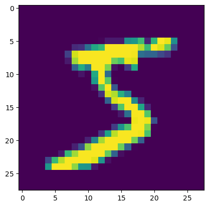
    


```python
plt.imshow(numpy_img, cmap='gray');
```


    
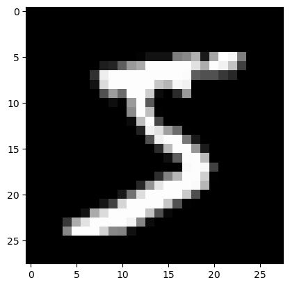
    


Отрисовка заданной цифры:


```python
# случайный индекс от 0 до размера тренировочной выборки
i = np.random.randint(low=0, high=60000)

plt.imshow(trainloader.dataset.data[i].numpy(), cmap='gray');
```


    
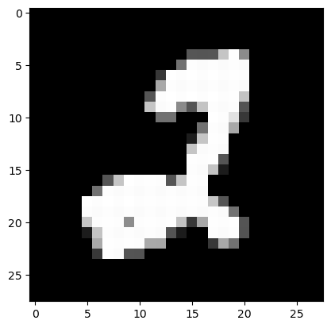
    


Как итерироваться по данным с помощью loader'а


```python
for data in trainloader:
    print(data)
    break
```

    [tensor([[[[0., 0., 0.,  ..., 0., 0., 0.],
              [0., 0., 0.,  ..., 0., 0., 0.],
              [0., 0., 0.,  ..., 0., 0., 0.],
              ...,
              [0., 0., 0.,  ..., 0., 0., 0.],
              [0., 0., 0.,  ..., 0., 0., 0.],
              [0., 0., 0.,  ..., 0., 0., 0.]]],
    
    
            [[[0., 0., 0.,  ..., 0., 0., 0.],
              [0., 0., 0.,  ..., 0., 0., 0.],
              [0., 0., 0.,  ..., 0., 0., 0.],
              ...,
              [0., 0., 0.,  ..., 0., 0., 0.],
              [0., 0., 0.,  ..., 0., 0., 0.],
              [0., 0., 0.,  ..., 0., 0., 0.]]],
    
    
            [[[0., 0., 0.,  ..., 0., 0., 0.],
              [0., 0., 0.,  ..., 0., 0., 0.],
              [0., 0., 0.,  ..., 0., 0., 0.],
              ...,
              [0., 0., 0.,  ..., 0., 0., 0.],
              [0., 0., 0.,  ..., 0., 0., 0.],
              [0., 0., 0.,  ..., 0., 0., 0.]]],
    
    
            [[[0., 0., 0.,  ..., 0., 0., 0.],
              [0., 0., 0.,  ..., 0., 0., 0.],
              [0., 0., 0.,  ..., 0., 0., 0.],
              ...,
              [0., 0., 0.,  ..., 0., 0., 0.],
              [0., 0., 0.,  ..., 0., 0., 0.],
              [0., 0., 0.,  ..., 0., 0., 0.]]]]), tensor([7, 7, 2, 0])]
    

То есть мы имеем дело с кусочками данных размера batch_size (в данном случае = 4), причём в каждом батче есть как объекты, так и ответы на них (то есть и $X$, и $y$).

Теперь вернёмся к тому, что в PyTorch есть две "парадигмы" построения нейросетей -- `Functional` и `Seuquential`. Мы испольузем именно `Functional` парадигму, потому что при построении свёрточных сетей это намного удобнее:


```python
import torch.nn as nn
import torch.nn.functional as F  # Functional
```


```python
# ЗАМЕТЬТЕ: КЛАСС НАСЛЕДУЕТСЯ ОТ nn.Module
class SimpleConvNet(nn.Module):
    def __init__(self):
        # вызов конструктора предка
        super(SimpleConvNet, self).__init__()
        # необходмо заранее знать, сколько каналов у картинки (сейчас = 1),
        # которую будем подавать в сеть, больше ничего
        # про входящие картинки знать не нужно
        self.conv1 = nn.Conv2d(in_channels=1, out_channels=6, kernel_size=5)
        self.pool = nn.MaxPool2d(kernel_size=2, stride=2)
        self.conv2 = nn.Conv2d(in_channels=6, out_channels=16, kernel_size=5)
        self.fc1 = nn.Linear(4 * 4 * 16, 120)  # !!!
        self.fc2 = nn.Linear(120, 84)
        self.fc3 = nn.Linear(84, 10)

    def forward(self, x):
        x = self.pool(F.relu(self.conv1(x)))
        x = self.pool(F.relu(self.conv2(x)))
        #print(x.shape)
        x = x.view(-1, 4 * 4 * 16)  # !!!
        x = F.relu(self.fc1(x))
        x = F.relu(self.fc2(x))
        x = self.fc3(x)
        return x
```


```python
net = SimpleConvNet()

summary(net.cuda(), (1,28, 28))
```

    ----------------------------------------------------------------
            Layer (type)               Output Shape         Param #
    ================================================================
                Conv2d-1            [-1, 6, 24, 24]             156
             MaxPool2d-2            [-1, 6, 12, 12]               0
                Conv2d-3             [-1, 16, 8, 8]           2,416
             MaxPool2d-4             [-1, 16, 4, 4]               0
                Linear-5                  [-1, 120]          30,840
                Linear-6                   [-1, 84]          10,164
                Linear-7                   [-1, 10]             850
    ================================================================
    Total params: 44,426
    Trainable params: 44,426
    Non-trainable params: 0
    ----------------------------------------------------------------
    Input size (MB): 0.00
    Forward/backward pass size (MB): 0.04
    Params size (MB): 0.17
    Estimated Total Size (MB): 0.22
    ----------------------------------------------------------------
    


```python
batch = []


batch = next(iter(trainloader))

net.forward(torch.FloatTensor(batch[0]).cuda())
```


    tensor([[ 0.0177,  0.0042,  0.0053,  0.0035, -0.0878, -0.1464,  0.1212, -0.0528,
              0.1519,  0.1285],
            [ 0.0155,  0.0130,  0.0124, -0.0038, -0.0985, -0.1321,  0.1262, -0.0620,
              0.1600,  0.1280],
            [ 0.0210,  0.0068,  0.0016, -0.0046, -0.0896, -0.1445,  0.1203, -0.0540,
              0.1548,  0.1282],
            [ 0.0207,  0.0087, -0.0028,  0.0034, -0.0893, -0.1422,  0.1244, -0.0681,
              0.1511,  0.1258]], device='cuda:0', grad_fn=<AddmmBackward0>)


**Важное примечание:** Вы можете заметить, что в строчках с `#!!!` есть не очень понятный сходу 4 `*` 4 `*` 16. Это -- размерность картинки перед FC-слоями (H x W x C), тут её приходиться высчитывать вручную (в Keras, например, `.Flatten()` всё делает за Вас). Однако есть один *лайфхак* -- просто сделайте в `forward()` `print(x.shape)` (закомментированная строка). Вы увидите размер `(batch_size, C, H, W)` -- нужно перемножить все, кроме первого (batch_size), это и будет первая размерность `Linear()`, и именно в C * H * W нужно "развернуть" x перед подачей в `Linear()`.  

То есть нужно будет запустить цикл с обучением первый раз с `print()` и сделать после него `break`, посчитать размер, вписать его в нужные места и стереть `print()` и `break`.

Код обучения слоя:


```python
from tqdm.notebook import tqdm #прогресс-бары
```


```python
# объявляем сеть
net = SimpleConvNet().to(device)
```


```python
# выбираем функцию потерь
loss_fn = torch.nn.CrossEntropyLoss()

# выбираем алгоритм оптимизации и learning_rate
learning_rate = 1e-4
optimizer = torch.optim.Adam(net.parameters(), lr=learning_rate) #net.parameters() возвращает генератор всех обучаемых параметров модели
losses = []
```


```python
cnt = 0
temp = 0
for i, batch in enumerate(tqdm(trainloader)):  #enumerate используется для добавления индекса к каждому элементу, получаемому из итератора
        # так получаем текущий батч
        X_batch, y_batch = batch
        cnt = i
        if i % 2000 == 1999:
          temp += 1 
cnt,temp
```


      0%|          | 0/15000 [00:00<?, ?it/s]


    (14999, 7)


```python
fig = plt.figure(figsize=(10,7))
ax = fig.add_subplot(1, 1, 1)

# итерируемся
for epoch in tqdm(range(2)):

    running_loss = 0.0
    for i, batch in enumerate(tqdm(trainloader)):
        # так получаем текущий батч
        X_batch, y_batch = batch
        
        # обнуляем веса
        optimizer.zero_grad()

        # forward + backward + optimize
        y_pred = net(X_batch.to(device))
        loss = loss_fn(y_pred, y_batch.to(device))
        loss.backward()
        optimizer.step()

        # выведем текущий loss
        running_loss += loss.item()
        # выведем качество каждые 2000 батчей
        if i % 2000 == 1999:
            print('[%d, %5d] loss: %.3f' %
                  (epoch + 1, i + 1, running_loss / 2000))
            losses.append(running_loss)
            running_loss = 0.0

    ax.clear()
    ax.plot(np.arange(len(losses)), losses)
    plt.show()

print('Обучение закончено')
```


      0%|          | 0/2 [00:00<?, ?it/s]


      0%|          | 0/15000 [00:00<?, ?it/s]


    [1,  2000] loss: 0.996
    [1,  4000] loss: 0.363
    [1,  6000] loss: 0.286
    [1,  8000] loss: 0.235
    [1, 10000] loss: 0.186
    [1, 12000] loss: 0.186
    [1, 14000] loss: 0.151
    


    
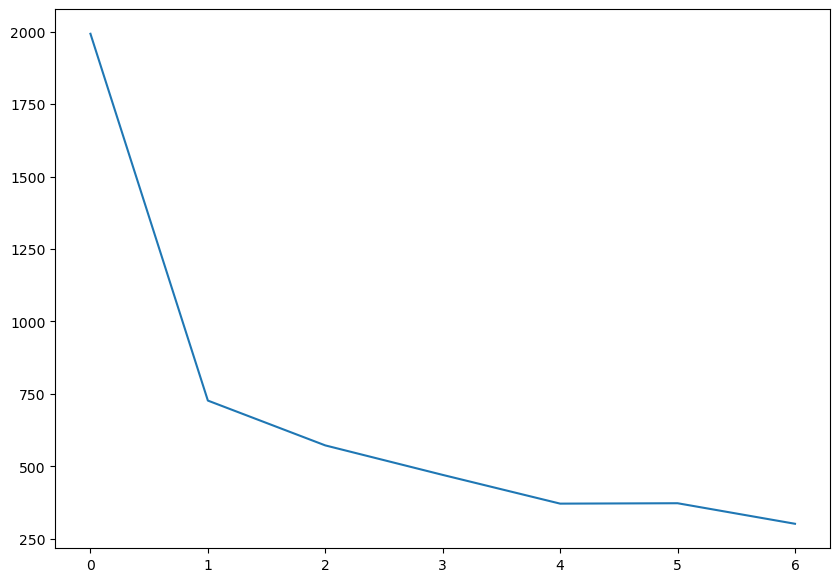
    


      0%|          | 0/15000 [00:00<?, ?it/s]


    [2,  2000] loss: 0.137
    [2,  4000] loss: 0.117
    [2,  6000] loss: 0.112
    [2,  8000] loss: 0.116
    [2, 10000] loss: 0.108
    [2, 12000] loss: 0.102
    [2, 14000] loss: 0.094
    Обучение закончено
    


```python
class_correct = list(0. for i in range(10))
class_total = list(0. for i in range(10))

with torch.no_grad(): #чтобы не обновалять градиенты
    for data in testloader:
        images, labels = data
        y_pred = net(images.to(device)) # y_pred — это тензор логитов размером [batch_size, 10]
        _, predicted = torch.max(y_pred, 1) # 1 — это ось, по которой нужно найти максимальное значение. В данном случае ось 1 — это ось классов
        #torch.max(y_pred, 1) Выдает два значения. 1 - значение максимального логита, 2 - его индекс, который в нашем случае совпадает с меткой класса
        c = (predicted.cpu() == labels) #сравнивает предсказания с истинными метками. Результат — это булевый тензор той же длины, что и батч
        for i in range(4):
            label = labels[i]
            class_correct[label] += c[i].item() #c[i].item() — преобразует булевое значение в 0 или 1
            class_total[label] += 1


for i in range(10):
    print('Accuracy of %5s : %2d %%' % (
        classes[i], 100 * class_correct[i] / class_total[i]))
```

    Accuracy of     0 : 98 %
    Accuracy of     1 : 99 %
    Accuracy of     2 : 98 %
    Accuracy of     3 : 97 %
    Accuracy of     4 : 95 %
    Accuracy of     5 : 98 %
    Accuracy of     6 : 96 %
    Accuracy of     7 : 97 %
    Accuracy of     8 : 96 %
    Accuracy of     9 : 96 %
    

# CIFAR10


**CIFAR10:** это набор из 60k картинок 32х32х3, 50k которых составляют обучающую выборку, и оставшиеся 10k - тестовую. Классов в этом датасете 10: `'plane', 'car', 'bird', 'cat', 'deer', 'dog', 'frog', 'horse', 'ship', 'truck'`.

Скачаем и загрузим в `loader`'ы:

**Обратите внимание на аргумент `batch_size`:** именно он будет отвечать за размер батча, который будет подаваться при оптимизации нейросети


```python
import torch
import torchvision
from torchvision import transforms
from torchsummary import summary
from tqdm.notebook import tqdm #прогресс-бары
import numpy as np
import torch.nn as nn
import torch.nn.functional as F  # Functional
import matplotlib.pyplot as plt  # для отрисовки картиночек
%matplotlib inline

# Проверяем, доступны ли GPU
device = 'cuda' if torch.cuda.is_available() else 'cpu'
```


```python
transform = transforms.Compose(
    [transforms.ToTensor(),
     transforms.Normalize((0.4914, 0.4822, 0.4465), (0.2023, 0.1994, 0.2010))]) #ToTensor() делает пиксели в диапазоне [0, 1].
    #transforms.Normalize(mean, std) берёт каждый пиксель изображения и стандартизирует его x = (x - mean)/std
trainset = torchvision.datasets.CIFAR10(root='./data', train=True,
                                        download=True, transform=transform)
trainloader = torch.utils.data.DataLoader(trainset, batch_size=128,
                                          shuffle=True, num_workers=2)

testset = torchvision.datasets.CIFAR10(root='./data', train=False,
                                       download=True, transform=transform)
testloader = torch.utils.data.DataLoader(testset, batch_size=128,
                                         shuffle=False, num_workers=2)

classes = ('plane', 'car', 'bird', 'cat',
           'deer', 'dog', 'frog', 'horse', 'ship', 'truck')
```

    Files already downloaded and verified
    Files already downloaded and verified
    


```python
# случайный индекс от 0 до размера тренировочной выборки
i = np.random.randint(low=0, high=50000)

plt.imshow(trainloader.dataset.data[i]);
```


    
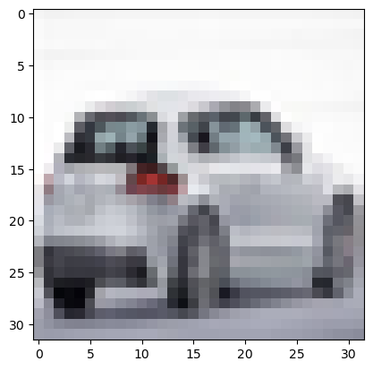
    


То есть мы имеем дело с кусочками данных размера batch_size (в данном случае = 4), причём в каждом батче есть как объекты, так и ответы на них (то есть и $X$, и $y$).

Данные готовы, мы даже на них посмотрели.

Напишите свою свёрточную нейросеть для предсказания на CIFAR10.


```python
next(iter(trainloader))[0].shape
```


    torch.Size([128, 3, 32, 32])


```python
class MyConvNet(nn.Module):
    def __init__(self):
        # вызов конструктора предка
        super().__init__()
        # необходмо заранее знать, сколько каналов у картинки (сейчас = 3),
        # которую будем подавать в сеть, больше ничего
        # про входящие картинки знать не нужно
        self.conv1 = nn.Conv2d(in_channels=3, out_channels=64, kernel_size=5)
        self.pool = nn.MaxPool2d(kernel_size=2, stride=2)
        self.conv2 = nn.Conv2d(in_channels=64, out_channels=128, kernel_size=3)
        self.fc1 = nn.Linear(6 * 6 * 128, 128)  # !!!
        self.fc2 = nn.Linear(128, 64)
        self.fc3 = nn.Linear(64, 10)

    def forward(self, x):
        #(32,32)
        x = self.pool(F.relu(self.conv1(x)))
        #(14,14)
        x = self.pool(F.relu(self.conv2(x)))
        #(6,6)
        #print(x.shape)
        x = x.view(-1, 6 * 6 * 128)  # !!!
        x = F.relu(self.fc1(x))
        x = F.relu(self.fc2(x))
        x = self.fc3(x)
        return x
```

Обучим:


```python
# пример взят из официального туториала: 
# https://pytorch.org/tutorials/beginner/blitz/cifar10_tutorial.html

net = MyConvNet().to(device)

loss_fn = torch.nn.CrossEntropyLoss()

learning_rate = 1e-4
optimizer = torch.optim.Adam(net.parameters(), lr=learning_rate)

# итерируемся
for epoch in tqdm(range(10)):

    running_loss = 0.0
    for i, batch in enumerate(tqdm(trainloader)):
        # так получаем текущий батч
        X_batch, y_batch = batch

        # обнуляем веса
        optimizer.zero_grad()

        # forward + backward + optimize
        y_pred = net(X_batch.to(device))
        loss = loss_fn(y_pred, y_batch.to(device))
        loss.backward()
        optimizer.step()

        # выведем текущий loss
        running_loss += loss.item()
        # выводем качество каждые 2000 батчей
        if i % 2000 == 1999:
            print('[%d, %5d] loss: %.3f' %
                  (epoch + 1, i + 1, running_loss / 2000))
            running_loss = 0.0

print('Обучение закончено')
```


      0%|          | 0/10 [00:00<?, ?it/s]


      0%|          | 0/391 [00:00<?, ?it/s]


      0%|          | 0/391 [00:00<?, ?it/s]


      0%|          | 0/391 [00:00<?, ?it/s]


      0%|          | 0/391 [00:00<?, ?it/s]


      0%|          | 0/391 [00:00<?, ?it/s]


      0%|          | 0/391 [00:00<?, ?it/s]


      0%|          | 0/391 [00:00<?, ?it/s]


      0%|          | 0/391 [00:00<?, ?it/s]


      0%|          | 0/391 [00:00<?, ?it/s]


      0%|          | 0/391 [00:00<?, ?it/s]


    Обучение закончено
    

Посмотрим на accuracy на тестовом датасете:


```python
class_correct = list(0. for i in range(10))
class_total = list(0. for i in range(10))

with torch.no_grad():
    for data in testloader:
        images, labels = data
        y_pred = net(images.to(device))#.view(4, -1))
        _, predicted = torch.max(y_pred, 1)
        c = (predicted.cpu().detach() == labels).squeeze()
        for i in range(len(labels)):
            label = labels[i]
            class_correct[label] += c[i].item()
            class_total[label] += 1


for i in range(10):
    print('Accuracy of %5s : %2d %%' % (
        classes[i], 100 * class_correct[i] / class_total[i]))
```

    Accuracy of plane : 72 %
    Accuracy of   car : 83 %
    Accuracy of  bird : 45 %
    Accuracy of   cat : 44 %
    Accuracy of  deer : 56 %
    Accuracy of   dog : 60 %
    Accuracy of  frog : 77 %
    Accuracy of horse : 75 %
    Accuracy of  ship : 82 %
    Accuracy of truck : 64 %
    

Попытаемся улучить

Начнем с архитектуры сети


```python
class BetterConvNet(nn.Module):
    def __init__(self):
        # вызов конструктора предка
        super().__init__()
        # Блок 1: 3 -> 32 каналов
        self.conv1 = nn.Conv2d(in_channels=3, out_channels=32, kernel_size=3,padding = 1, stride = 1)
        self.bn1 = nn.BatchNorm2d(32)

        # Блок 2: 32 -> 64 каналов
        self.conv2 = nn.Conv2d(in_channels=32, out_channels=64, kernel_size=3,padding = 1, stride = 1)
        self.bn2 = nn.BatchNorm2d(64)

        # Блок 3: 64 -> 128 каналов
        self.conv3 = nn.Conv2d(in_channels = 64, out_channels = 128, kernel_size=3,padding = 1, stride = 1)
        self.bn3 = nn.BatchNorm2d(128)
                
        # MaxPool во всех блоках один и тот же
        self.pool = nn.MaxPool2d(kernel_size=2, stride=2)
        
        # После трёх пуллингов:
        # 32x32 -> 16x16 -> 8x8 -> 4x4
        # Значит размер фичей: 128 * 4 * 4
        
        self.fc1 = nn.Linear(4 * 4 * 128, 256) 
        self.fc2 = nn.Linear(256, 128)
        self.fc3 = nn.Linear(128, 10)

        self.dropout = nn.Dropout(p=0.5)

    def forward(self, x):
        # Вход: (B, 3, 32, 32)
        # Блок 1
        x = self.pool(F.relu(self.bn1(self.conv1(x))))   # -> (B, 32, 16, 16)
        # Блок 2
        x = self.pool(F.relu(self.bn2(self.conv2(x))))   # -> (B, 64, 8, 8)
        # Блок 3
        x = self.pool(F.relu(self.bn3(self.conv3(x))))   # -> (B, 128, 4, 4)

        # Расплющиваем
        x = x.view(x.size(0),-1)    # (B, 128*4*4)

        x = self.dropout(F.relu(self.fc1(x)))
        x = self.dropout(F.relu(self.fc2(x)))
        x = self.fc3(x)# логиты (B, 10)
        return x
```


```python
device = torch.device("cuda" if torch.cuda.is_available() else "cpu")

net = BetterConvNet().to(device)

loss_fn = nn.CrossEntropyLoss()

learning_rate = 1e-3
optimizer = torch.optim.Adam(net.parameters(), lr=learning_rate, weight_decay=1e-4) # weight_decay = L2-регуляризация
num_epochs = 20 

```


```python
for epoch in tqdm(range(num_epochs)):

    running_loss = 0.0
    for i, batch in enumerate(tqdm(trainloader)):
        # так получаем текущий батч
        X_batch, y_batch = batch

        # обнуляем веса
        optimizer.zero_grad()

        # forward + backward + optimize
        y_pred = net(X_batch.to(device))
        loss = loss_fn(y_pred, y_batch.to(device))
        loss.backward()
        optimizer.step()

        # выведем текущий loss
        running_loss += loss.item()
        # выводем качество каждые 2000 батчей
        if i % 2000 == 1999:
            print('[%d, %5d] loss: %.3f' %
                  (epoch + 1, i + 1, running_loss / 2000))
            running_loss = 0.0

print('Обучение закончено')
```


      0%|          | 0/20 [00:00<?, ?it/s]


      0%|          | 0/391 [00:00<?, ?it/s]


      0%|          | 0/391 [00:00<?, ?it/s]


      0%|          | 0/391 [00:00<?, ?it/s]


      0%|          | 0/391 [00:00<?, ?it/s]


      0%|          | 0/391 [00:00<?, ?it/s]


      0%|          | 0/391 [00:00<?, ?it/s]


      0%|          | 0/391 [00:00<?, ?it/s]


      0%|          | 0/391 [00:00<?, ?it/s]


      0%|          | 0/391 [00:00<?, ?it/s]


      0%|          | 0/391 [00:00<?, ?it/s]


      0%|          | 0/391 [00:00<?, ?it/s]


      0%|          | 0/391 [00:00<?, ?it/s]


      0%|          | 0/391 [00:00<?, ?it/s]


      0%|          | 0/391 [00:00<?, ?it/s]


      0%|          | 0/391 [00:00<?, ?it/s]


      0%|          | 0/391 [00:00<?, ?it/s]


      0%|          | 0/391 [00:00<?, ?it/s]


      0%|          | 0/391 [00:00<?, ?it/s]


      0%|          | 0/391 [00:00<?, ?it/s]


      0%|          | 0/391 [00:00<?, ?it/s]


    Обучение закончено
    


```python
class_correct = list(0. for i in range(10))
class_total = list(0. for i in range(10))

with torch.no_grad():
    for data in testloader:
        images, labels = data
        y_pred = net(images.to(device))#.view(4, -1))
        _, predicted = torch.max(y_pred, 1)
        c = (predicted.cpu().detach() == labels).squeeze()
        for i in range(4):
            label = labels[i]
            class_correct[label] += c[i].item()
            class_total[label] += 1


for i in range(10):
    print('Accuracy of %5s : %2d %%' % (
        classes[i], 100 * class_correct[i] / class_total[i]))
```

    Accuracy of plane : 89 %
    Accuracy of   car : 92 %
    Accuracy of  bird : 75 %
    Accuracy of   cat : 52 %
    Accuracy of  deer : 66 %
    Accuracy of   dog : 66 %
    Accuracy of  frog : 77 %
    Accuracy of horse : 84 %
    Accuracy of  ship : 90 %
    Accuracy of truck : 71 %
    

Результат стал значительно лучше


```python
# ТРЕНИРОВОЧНЫЕ ТРАНСФОРМЫ (с аугментацией)
transform_train = transforms.Compose([
    transforms.RandomHorizontalFlip(),
    transforms.RandomCrop(32, padding=4), # увеличивает картинку до 40×40 а затем случайно вырезает из неё участок размером 32×32.
    transforms.ToTensor(),
    transforms.Normalize(
        (0.4914, 0.4822, 0.4465),
        (0.2023, 0.1994, 0.2010)
    ),
])

# ТЕСТОВЫЕ ТРАНСФОРМЫ (БЕЗ аугментации!)
transform_test = transforms.Compose([
    transforms.ToTensor(),
    transforms.Normalize(
        (0.4914, 0.4822, 0.4465),
        (0.2023, 0.1994, 0.2010)
    ),
])

```


```python
net = BetterConvNet().to(device)
loss_fn = torch.nn.CrossEntropyLoss()

learning_rate = 1e-3
optimizer = torch.optim.Adam(net.parameters(), lr=learning_rate, weight_decay=1e-4) # weight_decay = L2-регуляризация
num_epochs = 20
```


```python
for epoch in tqdm(range(num_epochs)):
    net.train()
    running_loss = 0.0
    for i, batch in enumerate(tqdm(trainloader)):
        # так получаем текущий батч
        X_batch, y_batch = batch

        # обнуляем веса
        optimizer.zero_grad()

        # forward + backward + optimize
        y_pred = net(X_batch.to(device))
        loss = loss_fn(y_pred, y_batch.to(device))
        loss.backward()
        optimizer.step()

        # выведем текущий loss
        running_loss += loss.item()
        # выводем качество каждые 2000 батчей
        if i % 2000 == 1999:
            print('[%d, %5d] loss: %.3f' %
                  (epoch + 1, i + 1, running_loss / 2000))
            running_loss = 0.0

print('Обучение закончено')
```


      0%|          | 0/20 [00:00<?, ?it/s]


      0%|          | 0/391 [00:00<?, ?it/s]


      0%|          | 0/391 [00:00<?, ?it/s]


      0%|          | 0/391 [00:00<?, ?it/s]


      0%|          | 0/391 [00:00<?, ?it/s]


      0%|          | 0/391 [00:00<?, ?it/s]


      0%|          | 0/391 [00:00<?, ?it/s]


      0%|          | 0/391 [00:00<?, ?it/s]


      0%|          | 0/391 [00:00<?, ?it/s]


      0%|          | 0/391 [00:00<?, ?it/s]


      0%|          | 0/391 [00:00<?, ?it/s]


      0%|          | 0/391 [00:00<?, ?it/s]


      0%|          | 0/391 [00:00<?, ?it/s]


      0%|          | 0/391 [00:00<?, ?it/s]


      0%|          | 0/391 [00:00<?, ?it/s]


      0%|          | 0/391 [00:00<?, ?it/s]


      0%|          | 0/391 [00:00<?, ?it/s]


      0%|          | 0/391 [00:00<?, ?it/s]


      0%|          | 0/391 [00:00<?, ?it/s]


      0%|          | 0/391 [00:00<?, ?it/s]


      0%|          | 0/391 [00:00<?, ?it/s]


    Обучение закончено
    


```python
class_correct = list(0. for i in range(10))
class_total = list(0. for i in range(10))
net.eval()
with torch.no_grad():
    for data in testloader:
        images, labels = data
        y_pred = net(images.to(device))#.view(4, -1))
        _, predicted = torch.max(y_pred, 1)
        c = (predicted.cpu().detach() == labels).squeeze()
        for i in range(len(labels)):
            label = labels[i]
            class_correct[label] += c[i].item()
            class_total[label] += 1


for i in range(10):
    print('Accuracy of %5s : %2d %%' % (
        classes[i], 100 * class_correct[i] / class_total[i]))
```

    Accuracy of plane : 78 %
    Accuracy of   car : 86 %
    Accuracy of  bird : 72 %
    Accuracy of   cat : 70 %
    Accuracy of  deer : 80 %
    Accuracy of   dog : 60 %
    Accuracy of  frog : 75 %
    Accuracy of horse : 84 %
    Accuracy of  ship : 88 %
    Accuracy of truck : 91 %
    


```python

```
